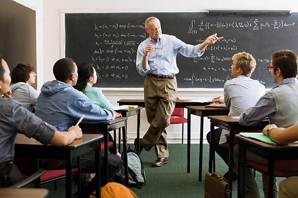

# In Motion and Action

Seorang guru besar University of Florida bernama Jerry Uelsmann, membagi mahasiswa jurusan fotografinya menjadi dua kelompok.

Setiap Mahasiswa dibagian kiri ruang kuliah, akan menjadi kelompok _"kuantitas"_. Mereka dinilai hanya berdasarkan jumlah karya yang mereka hasilkan. Pada akhir semester, ia akan menghitung jumlah foto yang dikirimkan oleh setiap mahasiswa dalam kelompok itu. Seratus foto akan mendapat nilai A, sembilan puluh foto bernilai B, delapan puluh foto bernilai C, dan seterusnya.

Sementara, setiap mahasiswa dibagian kanan ruang kuliah, akan disebut sebagai kelompok _"kualitas"_. Mereka dinilai hanya berdasarkan kehebatan karya mereka. Mereka hanya perlu membuat satu karya foto selama semester itu, tapi untuk mendapatkan nilai A, foto itu harus mendekati sempurna.

Pada akhir semester, diluar dugaannya, semua foto terbaik dihasilkan oleh kelompok _kuantitas_. Selama semester itu, mahasiswa-mahasiswa kelompok itu sibuk membuat foto, bereksperimen dengan komposisi dan pencahayaan, menguji berbagai metode di ruang gelap, dan belajar dari kesalahan-kesalahan mereka. Dalam proses membuat foto, mereka mengasah keterampilan.

Sedangkan, kelompok _kualitas_ hanya melamun tentang kesempurnaan. Pada akhirnya, hanya sedikit yang mereka tunjukkan sebagai bukti usaha mereka. Mereka tidak menggali teori-teori yang diajarkan dan hanya menghasilkan foto biasa-biasa.

Banyak orang mudah terlena ketika mencoba menyusun rencana yang optimal untuk perubahan. Entah itu cara paling cepat untuk mempelajari bahasa baru, program terbaik untuk membentuk tubuh yang sehat, gagasan sempurna untuk usaha sampingan dan lain sebagainya.

**Kita terlalu berfokus memikirkan pendekatan terbaik, sehingga tidak pernah sampai beraksi.**

Hal semacam ini dikarenakan masih banyak yang menganggap bahwa antara _in motion_ dan _in action_ adalah sama. Memang kedua gagasan ini terkesan serupa, padahal sesungguhnya tidaklah sama. 

Ketika seseorang _in motion_, orang tersebut membuat rencana, membuat strategi dan belajar. Semua itu baik, tapi tidak membuahkan hasil. Sebaliknya, _action_ adalah tipe perilaku yang memberikan hasil.

Apabila saya menulis sepuluh gagasan untuk tulisan bulanan yang ingin saya tulis, itu in motion. Sedangkan, kalau saya sungguh duduk dan menulis tulisan bulanan, itu sama dengan action.

Kadang _in motion_ ada gunanya, tapi perilaku itu tidak akan pernah membuahkan hasil dengan sendirinya. Tak peduli berapa kali Anda berdiskusi dengan olahragawan, kegiatan itu tidak akan pernah membentuk tubuh Anda. Hanya aksi berolahraga yang akan membuat Anda memperoleh hasil yang diinginkan.

Lantas, jika _in motion_ tidak mengantar kita ke hasil, mengapa kita melakukannya?

Padahal, kadang kita melakukannya karena kita sungguh perlu membuat rencana atau belajar lebih banyak. Namun, pada umumnya, kita melakukannya karena **_in motion_ memungkinkan kita merasa seolah-olah kita mendapatkan kemajuan tanpa menempuh resiko gagal**.

Kebanyakan dari kita adalah ahli dalam menghindari kritik. Tidak enak rasanya kalau sampai gagal atau ditegur di depan umum, jadi kita cenderung menghindari situasi-situasi yang memungkinkan hal itu terjadi. Dan itu merupakan alasan terbesar kebanyakan orang lebih banyak _in motion_ daripada _in action_. Seseorang **ingin menunda kegagalan**.

_In motion_ sambil menyakinkan diri bahwa kita masih membuat kemajuan. Kita berpikir, _"Sampai sekarang saya sudah berbicara dengan empat klien potensial. Ini bagus. Saya bergerak ke arah yang benar"_. Atau _"Saya sudah menggarap gagasan untuk menyusun proposal penelitian saya. Rasanya sudah hampir lengkap"_.

_In motion_ membuat kita merasa sudah mengerjakan sesuatu. Padahal, **sesungguhnya kita hanya bersiap untuk melakukan apa yang seharusnya kita lakukan**. Ketika persiapan menjadi semacam upaya menunda, ada yang perlu diubah. Karena kita tidak ingin hanya membuat rencana. Kita ingin menerapkannya.

 

Apabila ingin menguasai kebiasaan, kuncinya adalah mulai dengan perulangan, bukan membayangkan kesempurnaan. Kita tidak perlu memetakan setiap ciri kebiasaan baru. Yang diperlukan adalah menerapkannya.

Karena, membentuk kebiasaan adalah proses ketika suatu perilaku lambat laun menjadi lebih otomatis melalui perulangan. Semakin sering kita mengulang suatu kegiatan, maka semakin banyak struktur otak kita yang berubah menjadi lebih efisien dalam kegiatan itu. Sehingga, koneksi diantara neuron dalam otak saling menguat berdasarkan pola kegiatan baru.

Dengan tiap perulangan, pengiriman sinyal antar sel membaik dan koneksi-koneksi saraf makin erat. Seperti ketika seseorang belajar bicara dalam bahasa baru, Belajar memainkan alat musik, atau melakukan gerakan yang tidak biasa, orang tersebut merasakan kesulitan karena saluran-saluran yang harus dilalui oleh suatu sensasi belum mapan. Tapi, setelah perulangan yang sering berhasil membuat jalan pintas, kesulitan-kesulitan itu menghilang dan aksi menjadi begitu otomatis sehingga dapat dilakukan tanpa melibatkan pikiran sadar lagi.

Tiap kali mengulang suatu aksi, kita mengaktifkan rangkaian saraf tertentu yang terkait dengan kebiasaan termasud. Artinya, mengulang adalah salah satu langkah paling penting yang dapat kita ambil untuk menyandikan kebiasaan baru. Itulah sebabnya mahasiswa yang mengambil banyak foto mengalami keterampilan yang meningkat, sedangkan yang hanya berteori tentang foto sempurna tidak mengalaminya. Salah satu kelompok aktif dalam praktik, sedangkan yang lain belajar secara pasif. Yang satu disebut _action_ sedangkan yang lain disebut _in motion_.

---

_"Bentuk pembelajaran paling efektif adalah berlatih, bukan membuat rencana. Berfokus pada action bukan in motion. Karena, jumlah waktu melatih sebuah kebiasaan tidak sepenting jumlah pengulangan dalam melakukannya."_

