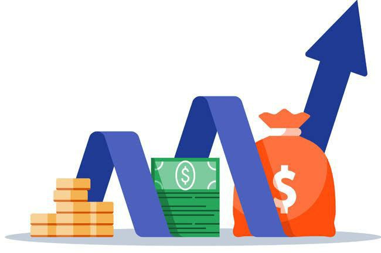
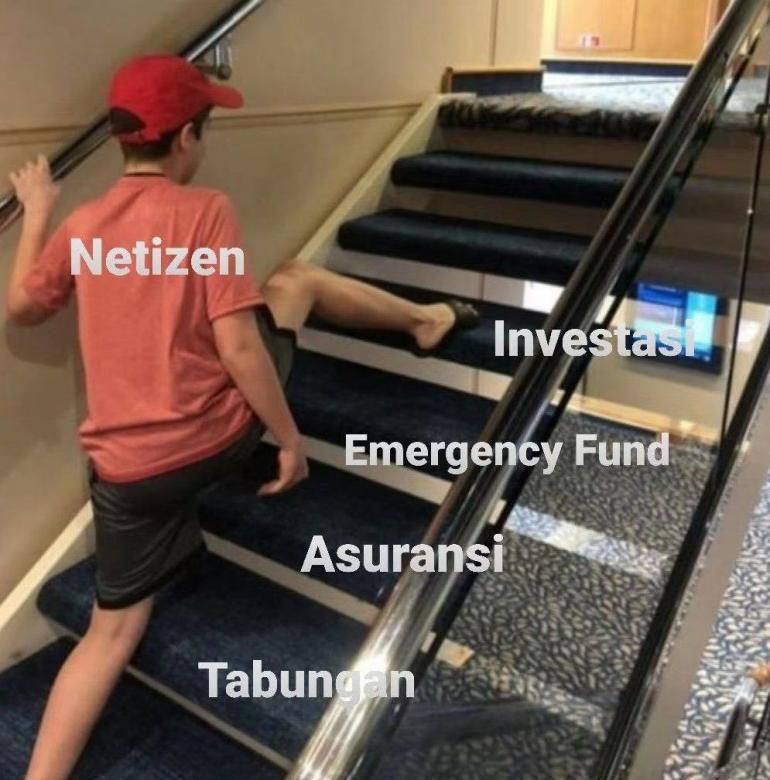
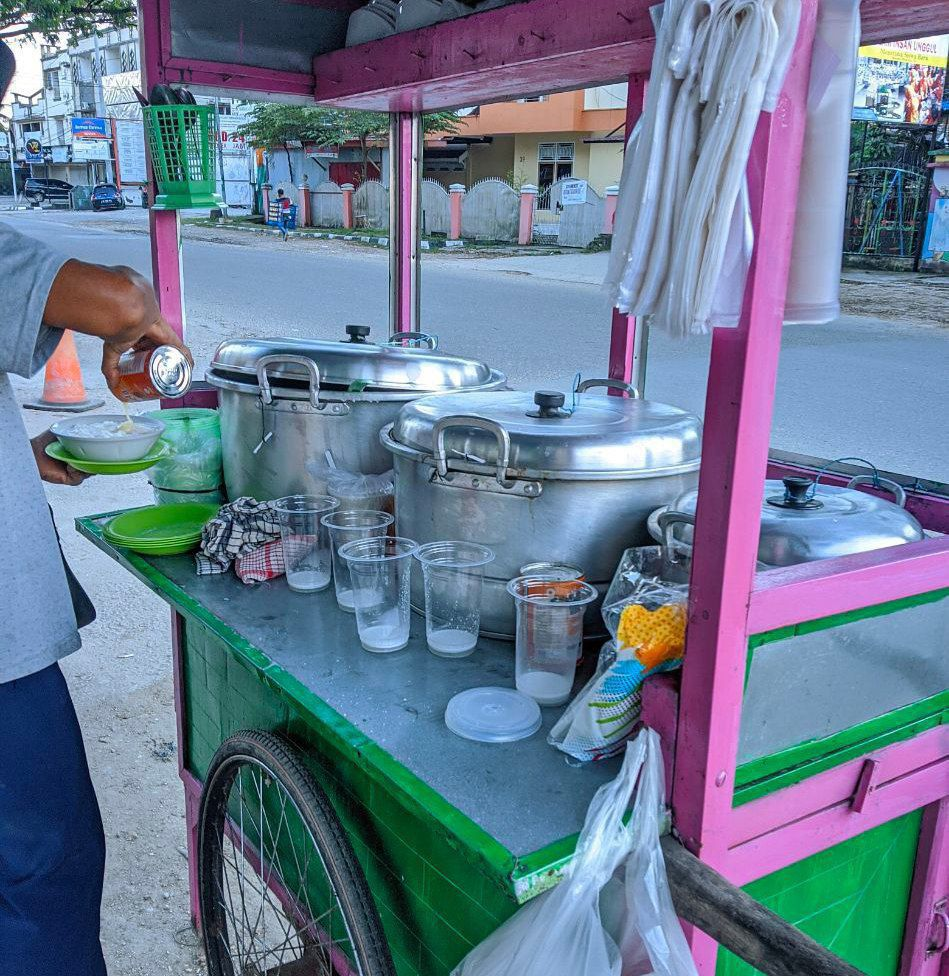
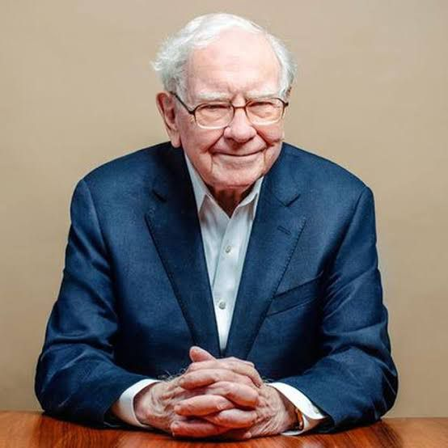
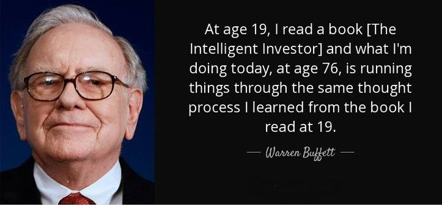
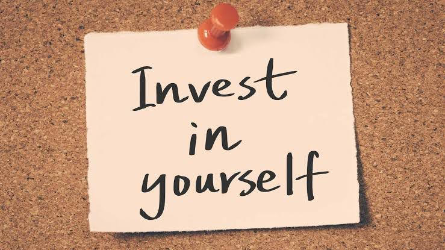

# Investasi

Investasi merupakan suatu hal yang tak asing lagi ditelinga. Setiap mendengar kata investasi, sebagian dari kita langsung terbayang sesuatu yang berhubungan dengan ekonomi dan keuangan, dimana seorang investor akan menempatkan sejumlah dana pada satu periode tertentu dengan harapan dana yang ditanamkan menghasilkan keuntungan maupun meningkatkan nilai investasi di kemudian hari.

Belakangan ramai dikalangan anak muda berbagai investasi seperti Reksadana, Obligasi, Properti, Peer to Peer Leanding, dlsb. Apalagi Saham, yang akhir-akhir ini menjadi salah satu instrumen investasi yang sedang melejit popularitasnya, sehingga siapa saja bisa bermain saham.

Jika berbicara mengenai saham, masih banyak orang yang belum memahami betul bahwasanya investasi saham merupakan level tertinggi dari menabung.

Ya, karena memang sebelum menabung saham, kita mesti menyiapkan tabungan emergency dan asuransi terlebih dahulu.

Tabungan darurat sangat penting dipersiapkan sebelum menanam saham, karena mencairkan uang dari bank lebih cepat daripada saham. Sedangkan yang dilakukan milenial sekarang :

 

Sederhananya, saham merupakan urunan kita terhadap perusahaan. Jadi, kita ikut memiliki perusahaan itu. Bila perusahaan itu sehat, tentu ada keuntungan yang diperoleh, dan sebagai pemilik tentunya kita akan mendapat bagian.

Bila kita memiliki 10% Saham, maka kita mendapatkan 10% dari keuntungan. Semisal bila keuntungannya 10T, maka kita akan mendapatkan bagian sebesar 1T.

Wah, cuan dong? Benar sekali maemunah! Masalahnya, Saham yang anda tanamkan per bulannya hanya 100rb.

Jika rata-rata return IHSG (Indeks Harga Saham Gabungan) berada di kisaran 10% dan modal anda sebesar 1 jt, maka anda akan mendapat keuntungan sebesar 100rb setahun. Dalam sebulan sekitar 8 rb-an. Dalam sehari? Cukup buat makan berapa kali??

Coba anda ajak orang macam si abang penjual Burjo ini buat investasi saham.

Pasti si abang Burjo (Bubur Kacang Ijo) ogah untuk ikutan. Menurut abang Burjo, uang sejuta itu lebih baik dijadikan modal untuk mengembangkan usahanya ketimbang investasi saham.

Secara logika, dengan uang sejuta itu, si abang Burjo bisa mendapatkan keuntungan sebesar 150rb per hari, atau 4.5 jt per bulan, atau 54 jt per tahun. Seandainya si abang Burjo berinvestasi saham 1 juta, maka dalam setahun keuntungannya cuma 10%, yaitu 100 ribu per tahun.

Nah, cuan mana laba 54 juta per tahun dibandingkan dengan investasi saham yang untungnya cuma 100 ribuan?

Jadi, bisa dikatakan **investasi saham itu tidak menguntungkan kalau kita belum kaya raya**.

Perputaran uang pada saham juga lamban. Tidak cocok bagi orang yang butuh dana cepat. Saham hanya cocok bagi mereka yang sudah punya banyak uang, tapi tidak tahu mau diapakan.

Kadang saya suka bingung dengan anak muda yang gaji masih pas-pasan, tabungan tidak ada, asuransi tidak punya, dana darurat apalagi, hidup masih kos-kosan atau numpang sama keluarga, bahkan makan pun dibuat ngirit pake indomi campur nasi, eh tapi malah invest saham.

Apalagi kalau yang sifatnya pemalas, dan hanya menghabiskan waktu seharian untuk googling cara kerja atau investasi dari rumah dengan modal 100 ribu tapi dapat 10 juta sebulan.

Memang sekarang ini sudah banyak broker saham yang menerima investasi minimal 100 ribu. Hanya dengan uang 100rb, seseorang sudah bisa menjadi pemilik saham perusahaan besar. Yang menjadi permasalahnya, kalau investasinya dimulai dengan modal pas-pasan, kapan kayanya?

Angka sangatlah berpengaruh dalam investasi. Semakin besar uangnya, semakin mudah mendapat keuntungannya. Kalau uangnya cuma 100 ribu? Nilai aset tersebut terperangkap dalam kisaran ratusan ribu (paling mentok jutaan).

Uang yang sedikit itu harus disimpan selama puluhan tahun kalau mau mendapatkan keuntungan yang memuaskan. Itu pun kalau rate of return-nya tinggi. Tapi saya rasa it is impossible karena Anda tidak mengerti apa-apa tentang saham.

Anda pasti bakal salah pilih perusahaan, atau terlalu cepat beli, atau telat beli, atau terlalu cepat jual karena takut kehilangan uang. Maklum, kita bukanlah Warren Buffet.

Coba anda tebak, investasi apa yang membuat Warren Buffet menjadi salah satu orang paling kaya di dunia?

Jawabannya adalah BUKU.

Memang dia menjadi kaya karena jual beli saham. Dia tahu perusahaan mana yang harus dia beli. Dia tahu perusahaan seperti apa yang nilainya bakal meningkat ratusan persen di masa mendatang.

Tapi pengetahuan itu dia dapat dari mana?

Jelas dari BUKU!

 

Warren Buffet pernah bilang bahwa dari semua investasi yang pernah dia buat dalam hidupnya, membeli buku The Intelligent Investor adalah yang terbaik.

Memang buku yang bagus harganya sedikit lebih mahal dari investasi minimum 100 ribu tadi, tapi buku bisa menghasilkan uang milyaran. Buku bisa merubah hidup manusia.

Ketimbang kita menghabiskan uang untuk investasi yang bersifat 'gambling', mending uangnya diinvestasikan untuk belajar. Soalnya nothing to lose.

Karena belajar saya rasa merupakan hal yang paling mudah dilakukan. Kita hanya perlu duduk dan membaca buku.

Namun, yang menjadi permasalahannya investasi di otak atau pendidikan itu proses panen hasilnya lama walaupun multiplier factor nya besar sekali ke depannya.

Akhirnya, kebanyakan orang hanya mau cepat panen tanpa kerja, makanya larilah dia ke reksadana, crypto, dll.

Padahal jika semisal kita membeli buku atau mengikuti online course belajar bahasa Mandarin, yang tentunya pasti melelahkan dan dianggap tidak berguna oleh sebagian orang, eh ternyata dengan maraknya pembangunan tambang nikel di berbagai wilayah Indonesia, translator Mandarin lagi pada dicari dan bayarannya belasan juta per bulan. Secara teknis, hal tersebut bisa diraih dengan modal membaca buku atau mengikuti online course.

Nanti begitu pemasukanmu sudah mulai meningkat, baru Anda punya ruang untuk belajar investasi yang memiliki resiko.

---

