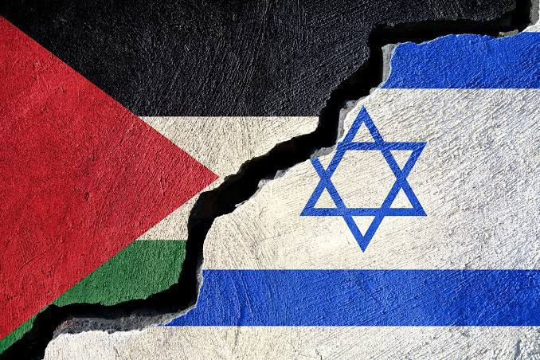
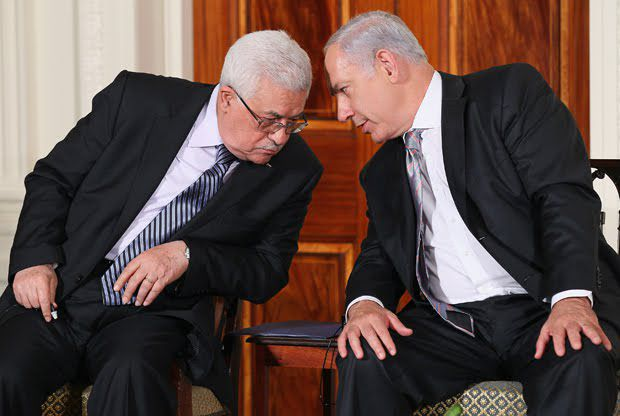
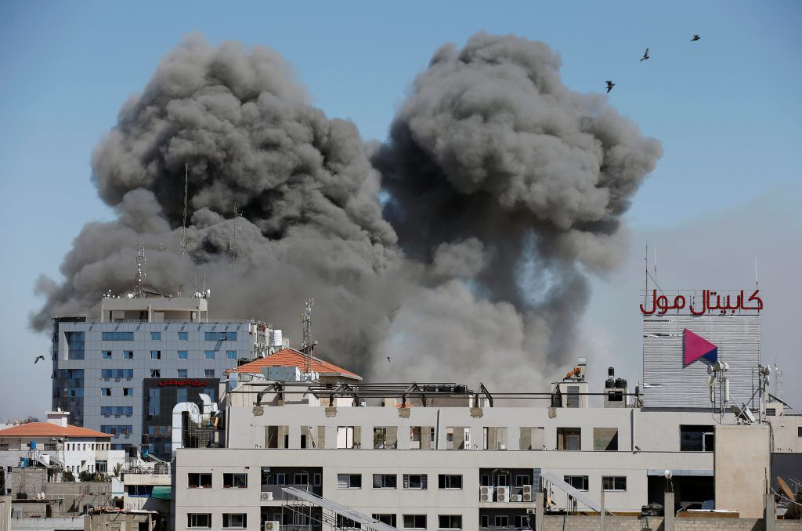
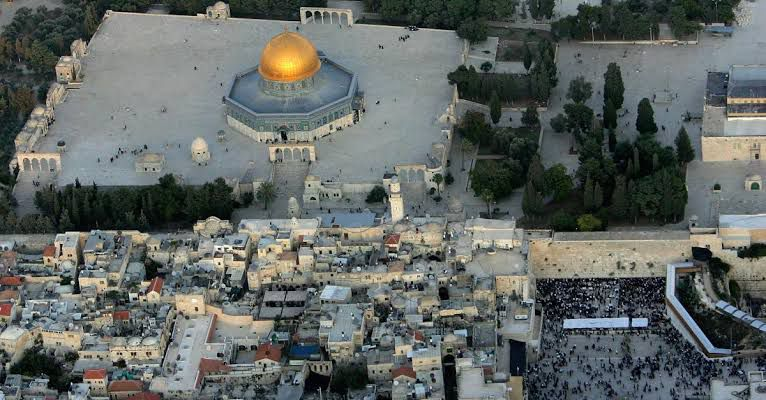
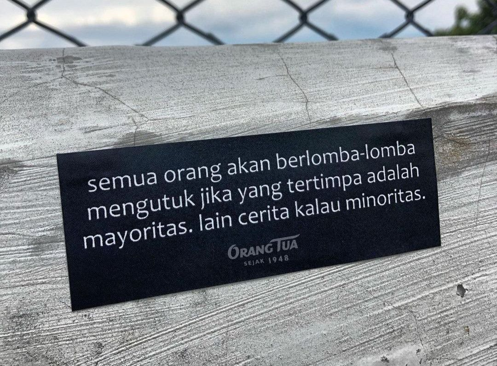
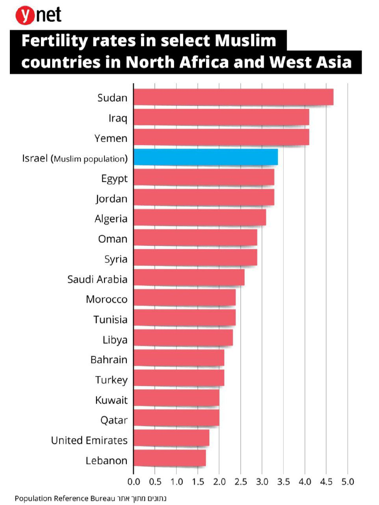
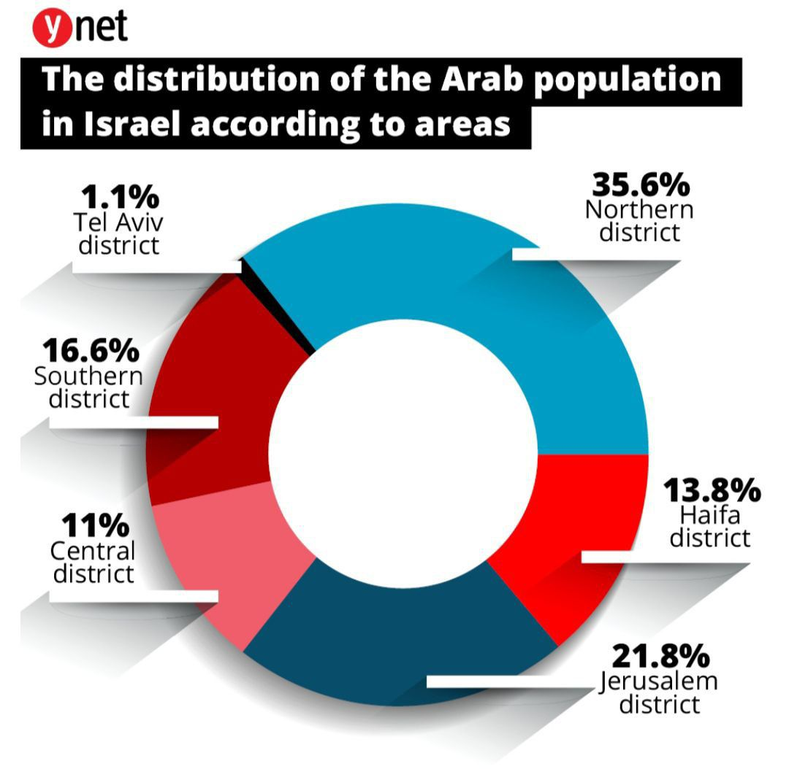
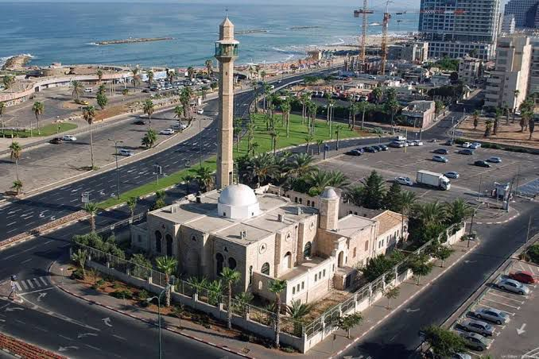
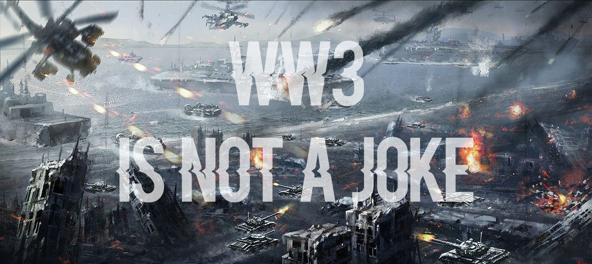
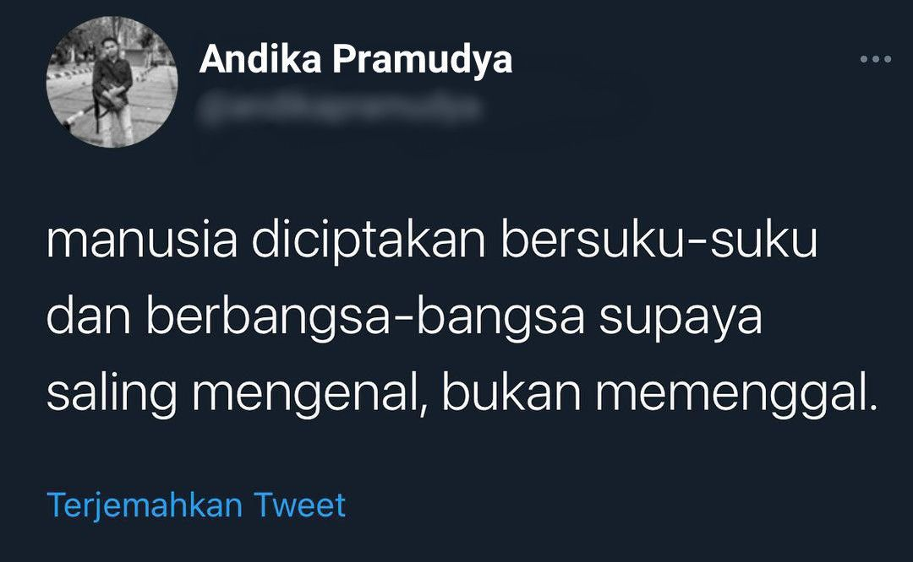

# Israel vs Palestina

Sepanjang yang saya ketahui mengenai konflik yang terjadi antara Israel dan Palestina di berbagai macam media massa yang selalu tertindas adalah pihak Palestina oleh arogansi Israel, sehingga masyarakat awam terutama Muslim akan mengutuk perlakuan Israel terhadap Palestina terlebih dari jumlah kerusakan dan korban jiwa yang berjatuhan.

Konflik ini juga berhasil membangun stigma di tengah masyarakat Islam sebagai konflik bernuansa agama. Pandangan ini setidaknya dibangun berdasarkan asumsi bahwa Palestina diyakini sebagai salah satu simbol spiritualitas Islam, dan korban yang berjatuhan di tanah Palestina secara umum adalah masyarakat Islam.

Padahal kalau kita ingin mengetahui secara mendalam permasalahan yang terjadi ini bukan merupakan konflik **AGAMA** tetapi sejatinya adalah konflik **POLITIK** yang diwakili oleh Hamas dari Palestina dan pihak Pemerintahan Israel. **Dua-duanya mau wilayah.**

Perlu diketahui bahwa di Palestina terdapat dua partai besar yang saling bersaing ketat antara satu sama lain di negaranya sendiri, yaitu **Hamas dan Fatah** [ [Hamas-Fatah Conflict](https://en.m.wikipedia.org/wiki/Fatah%E2%80%93Hamas_conflict) ]. Persaingan tersebut merupakan suatu fenomena politik dalam satu negara berupa persaingan antara dua kekuatan politik Palestina yang sulit dipersatukan dalam kerja sama yang harmonis.

Hampir sepanjang waktu partai Hamas yang Militan dan Fatah yang Moderat itu ribut, yang disebabkan karena garis haluan perjuangannya yang berbeda.

Meski secara de jure Palestina diwakili oleh PLO (Organisasi Pembebasan Palestina) [ [Palestine Liberation Organization](https://en.m.wikipedia.org/wiki/Palestine_Liberation_Organization) ], namun secara de facto pemerintahan mereka sudah pecah.

Tepi Barat dipimpin oleh PA (Otoritas Palestina) [ [Palestinian National Authority](https://en.m.wikipedia.org/wiki/Palestinian_National_Authority) ] (didominasi faksi Fatah) yang diakui PBB dan internasional, sedangkan Jalur Gaza dipimpin oleh faksi Hamas yang didukung Suriah, Iran dan Qatar. Dan sekarang menjadi salah satu faksi terbesar di Dewan Legislatif Palestina.

Faksi Fatah yang berwarna kuning, sedangkan Hamas yang berwarna hijau.

PLC (Dewan Legislatif Palestina) [ [Palestinian Legislative Council](https://en.m.wikipedia.org/wiki/Palestinian_Legislative_Council) ] saat ini terdiri dari 132 anggota yang dipilih dari 16 distrik pemilihan Otoritas Palestina. PLC memiliki persyaratan kuorum dua pertiga, dan sejak tahun 2006 Hamas dan anggota afiliasinya telah memegang 74 dari 132 kursi di PLC meskipun pemerintahan tetap dikontrol oleh PLO yang merupakan koalisi Fatah dan beberapa partai lain di West Bank.

Saya bukan pro Israel, bukan juga pro Palestina. Saya tidak mengakui ini sebagai Konflik Israel-Palestina, apalagi Konflik Yahudi-Islam. Melainkan sebagai **Konflik Israel-Hamas**.

Fatah [ [Fatah](https://simple.m.wikipedia.org/wiki/Fatah) ] sebetulnya relatif damai dengan Israel. Daerah panas di Tepi Barat itu hanya Yerusalem, dan yang menjadi musuh bebuyutan adalah Hamas di Gaza.

Sedangkan Hamas [ [Hamas](https://en.m.wikipedia.org/wiki/Hamas) ] merupakan organisasi Islam yang memperjuangkan kemerdekaan Palestina, dan juga pembubaran Negara Israel. Mereka menganggap bahwasannya Perjanjian Oslo [ [Oslo Accords](https://en.m.wikipedia.org/wiki/Oslo_Accords) ] itu ilegal, dan menganggap Fatah melanggar konstitusi karena bernegosiasi dengan Israel, dimana mereka tidak mengakui Israel sebagai negara.

Hamas sendiri diklasifikasikan dan dianggap sebagai **Organisasi Teroris** oleh banyak negara di dunia karena beberapa alasan :

- Piagam Hamas [ [Hamas Covenant](https://en.m.wikipedia.org/wiki/Hamas_Covenant) ] menyerukan Antisemitisme, menyalahkan orang-orang Yahudi atas segala revolusi dan perang dunia sepanjang sejarah, dan mengumbar perang terhadap orang Yahudi dengan menggunakan dasar agama. Ini berbeda dengan piagam PLO yang menekankan perjuangan melawan **Zionisme** berlandaskan nasionalisme Palestina, bukan melawan orang **Yahudi**. Berdasarkan piagam ini, Hamas menutup kemungkinan apa pun untuk berdamai dengan Israel. Bahkan mengimpikan kehancuran Israel. Ibaratnya, Israel mundur dari Tepi Barat sekalipun, Hamas akan tetap menghancurkan Israel.

- Hamas menargetkan rakyat sipil Israel dalam serangan-serangannya. Awalnya Hamas menggunakan bom bunuh diri [ [List of Palestinian suicide attacks](https://en.m.wikipedia.org/wiki/List_of_Palestinian_suicide_attacks) ]. Serangan bom bunuh dirinya yang paling mematikan adalah penyerangan pada hari Paskah 27 maret 2002 [ [Passover massacre](https://en.m.wikipedia.org/wiki/Passover_massacre) ] yang menewaskan 30 orang dan melukai 140. Belakangan Hamas menggunakan roket-roket dari Gaza yang menyerang pemukiman sipil di wilayah Israel. [ [Palestinian rocket attacks on Israel](https://en.m.wikipedia.org/wiki/Palestinian_rocket_attacks_on_Israel#:~:text=On%203%20April%2C%20Palestinians%20from,the%20Israeli%20city%20of%20Sderot.&text=On%2019%20June%2C%20three%20Grad,from%20Gaza%20since%2029%20April.) ].

- Hamas menggunakan warga sipilnya sendiri sebagai perisai hidup [ [Human Shield ](https://en.m.wikipedia.org/wiki/Human_shield)]. Serangan-serangan roket Hamas diluncurkan dari daerah-daerah padat penduduk di Gaza yang memperbesar kemungkinan korban sipil kalau ada serangan balasan Israel. Senjata dan roket disimpan di bawah sekolah, mesjid dan rumah penduduk sipil. Kalau ada penduduk Gaza yang tewas sebagai kolateral, Hamas juga akan memastikan foto-foto dan beritanya disebarkan ke seluruh dunia untuk memperlihatkan **Kebiadaban Israel**.

Israel, menurut saya sama bengisnya dengan Hamas. Memang dilematis, warga Palestina terus terkena serangan Israel, tapi yang mengerikan, Israel tetap melakukan serangan udara ke situs peluncuran roket yang dekat sekolah dan rumah sakit.

 

Ini yang jarang diceritakan oleh media. **Mereka mengincar situs peluncuran roket Hamas**. Tetapi tetap saja gila, karena korban jiwanya banyak. Tapi begitulah adanya.

Korban di pihak Israel memang tidak lebih banyak dari Palestina sendiri, tetapi angka tidak bisa membenarkan perbuatan Hamas. Jika Israel tidak punya Iron Dome [ [Iron Dome](https://en.m.wikipedia.org/wiki/Iron_Dome) ], saya yakin korban di Israel juga akan banyak. Kalau Palestina (Hamas) dikasih senjata ini itu, saya yakin "kejamnya" juga tidak lebih berbeda dengan apa yang Anda lihat dari tentara Israel. Sebab, pihak yang menang akan cenderung dipandang kejam, padahal dua-duanya bisa saja kejam.

Tetapi, bagi saya kaum konservatif di kedua belah pihak sama saja, yang satu orang Yahudi yang bersikeras tanah tersebut dijanjikan Tuhan, yang satu orang Arab macam Hamas yang juga bersikeras bahwa seluruh Yahudi harus angkat kaki dari daerah itu yang mengakibatkan konflik ini tak kunjung usai dan terus memakan korban.

Namun, kesalahan tidak bisa ditimpakan kepada salah satu pihak saja. Kedua belah pihak memiliki kesalahan, dan tidak ada yang tangannya benar-benar bersih. Kita juga harus menyikapi konflik ini secara adil, kedua belah pihak memiliki klaim masing-masing yang valid dan tidak bisa diabaikan atau disalahkan sepenuhnya.

Coba Anda baca-baca mengenai konflik ini dari sudut pandang netral atau bahkan dari sudut pandang Israel kalau perlu, sehingga penilaian Anda tidak berat sebelah.

Tindakan Israel menyerang dan membunuh warga sipil Palestina memang tidak **manusiawi**. Lantas, tindakan Hamas menyerang dan membunuh warga sipil Israel apakah **manusiawi**?

Realitanya konflik ini kalau tidak di framing "**Islam vs Yahudi**" sebenarnya berada ditingkat biasa-biasa saja. Tidak ada yang spesial atau signifikan seperti Nagorno-karabakh atau Kasmir dan ada banyak konflik serupa di Afrika.

konflik yang sesungguhnya itu justru: Penggusuran Syekh Jarrah [ [What is happening in occupied East Jerusalem’s Sheikh Jarrah?](https://www.aljazeera.com/news/2021/5/1/what-is-happening-in-occupied-east-jerusalems-sheikh-jarrah) ], Kericuhan Al-Aqsa [ [Al-Aqsa mosque: Dozens hurt in Jerusalem clashes](https://www.bbc.com/news/world-middle-east-57034237) ], dan puluhan konflik lain sepanjang tahun. Konflik ini hanya antara warga sipil dan polisi. IDF [ [Israel Defense Forces](https://en.m.wikipedia.org/wiki/Israel_Defense_Forces) ] tidak terlibat disini, kecuali sudah ada senjata api atau senjata tajam dari kubu Palestina.

Namun, sering kali argumen yang digunakan oleh simpatisan Palestina antara lain :

- Situs suci bagi umat Islam dalam kondisi terancam (Masjid Al-Aqsa).

- Warga Islam Palestina dibantai oleh Yahudi Israel, maka ini bentuk persaudaraan sesama umat Muslim atau alasan kemanusiaan.

Let Me Tell You :

Pertama, kompleks Masjid Al-Aqsa itu dibangun diatas kompleks tersuci penganut Judaisme/Yahudi, yaitu Temple Mount [ [Temple Mount](https://en.wikipedia.org/wiki/Temple_Mount) ]. Ini sudah seperti Mekkah atau Vatikan untuk orang Yahudi.

Lalu, dikiranya orang Yahudi menguasai Al-Aqsa?? Jawabannya **TIDAK**. Masjid Al-Aqsa itu dalam perwalian Dinasti Hashemite Yordania [ [Hashemite custodianship of Jerusalem holy sites](https://en.wikipedia.org/wiki/Hashemite_custodianship_of_Jerusalem_holy_sites#:~:text=Hashemite%20custodianship%20of%20Jerusalem%20holy%20sites%20refers%20to%20Jordan's,in%20the%20city%20of%20Jerusalem.&text=The%20custodianship%20became%20a%20Hashemite%20legacy%20administered%20by%20consecutive%20Jordanian%20kings.) ]. Tidak ada yang namanya Israel sekarang menguasai Al-Aqsa, yang ada orang Muslim yang menguasai Temple Mount.

Justru, orang Yahudi itu kalau berdoa di luar Temple Mount [ [3 Jewish Israelis indicted for praying on Temple Mount](https://www.timesofisrael.com/3-jewish-israelis-indicted-for-praying-on-temple-mount/) ]. Dan mereka baik-baik saja dengan ini.

Kedua, alasan persaudaraan atau kemanusiaan??

Ada banyak konflik lain yang lebih memakan banyak korban, misalkan:

1. [ [Nagorno-Karabakh conflict](https://en.wikipedia.org/wiki/Nagorno-Karabakh_conflict) ]. Ini malah lebih berbahaya dari Israel-Palestina.

2. [ [Syrian civil war](https://en.wikipedia.org/wiki/Syrian_civil_war) ]. Akibat dari perang ini, meski belum selesai, sudah sangat parah untuk warga Suriah.

3. [ [Yemeni Civil War (2014–present)](https://en.wikipedia.org/wiki/Yemeni_Civil_War_(2014%E2%80%93present)) ]. Ini juga kurang lebih dampaknya sama seperti Perang Sipil Suriah.

4. [ [Kashmir conflict](https://en.wikipedia.org/wiki/Kashmir_conflict) ]. Ini juga nasibnya tak lebih baik dari warga sipil Palestina.

Kalau anda mengatakan karena alasan kemanusiaan, Kemana suara anda saat konflik-konflik diatas? Kalau anda bilang karena agama, agama apanya? Kompleks tersuci Islam masih dijaga oleh Hashemite, sambil berkompromi dengan pihak keamanan Israel.

Jadi, **STOP** menyebut bahwa konflik Israel-Palestina adalah konflik Agama, yang sejatinya merupakan konflik Politik. Anda mau jihad ke Palestina sekalipun, anda juga harus **SADAR** kalau warga Palestina yang Yahudi [ [Palestinian Jews](https://en.wikipedia.org/wiki/Palestinian_Jews#%3A~%3Atext%3DPalestinian%20Jews%20were%20Jewish%20inhabitants%2Cthe%20modern%20state%20of%20Israel) ] dan kristen juga banyak [ Palestinian[ Christians](https://en.m.wikipedia.org/wiki/Palestinian_Christians) ].

Sebaliknya, yang mau ber-Zionis ria, dikiranya di Israel sendiri tidak ada warga Palestina, keturunan Arab, atau yang beragama Islam hidup di Israel?? Salah besar. Negara Israel merupakan negara demokrasi yang terdapat berbagai macam ras dan agama terutama dari Palestina itu sendiri, atau keturunan Arab, bahkan yang beragama Islam [ [Islam in Israel](https://en.wikipedia.org/wiki/Islam_in_Israel#%3A~%3Atext%3DMuslims%20comprise%2017.8%25%20of%20the%2Cparticipating%20in%20the%20Israeli%20army) ].

 

[ [Distribution of the Arab population in Israel according to settlement](https://www.ynetnews.com/articles/0,7340,L-5332166,00.html) ]

Dan jangan lupa kalau di Israel juga banyak terdapat bangunan suci yang bernama Masjid.

Salah satu Masjid Hassan Bek di Tel Aviv.

Masjid lainnya silahkan cek atau googling sendiri, pakai Google Earth juga bisa.

Paling tidak pemimpin-pemimpin di Timur Tengah dan Pemerintah Indonesia sendiri sudah lepas tangan untuk masalah peperangan. Mereka sudah menyadari hal tersebut dan kebanyakan lebih memilih untuk menempuh jalur komunikasi seperti pengecaman, voting, diplomasi dlsb.

Lalu dengan santainya Netizen +62 berkoar : _"Palestina Butuh Militer, Bukan Obat-obatan!!"_. Dan masih banyak lagi narasi-narasi serupa di Media Sosial yang saya temukan.

Where's Your Logic??

Sekarang **BAYANGKAN** ada negara lain yang ikut campur, lalu mengirim bantuan militer secara terang-terangan dan mengakibatkan semakin banyak korban di pihak Israel. Setelah itu apa yang akan terjadi??

Akhirnya kakaknya datang!! Kakaknya join dan ikut bermain. Nanti sudah bukan Israel-Palestina lagi, melainkan **DUNIA**.

**INGAT!!** Perang Dunia I awalnya hanya terjadi di Eropa saja, tetapi gara-gara negara lain ikut campur, lama-kelamaan masalah semakin membesar.

**INGAT JUGA!!** Sekarang sudah ada Teknologi Nuklir. Kalau dulu paling mentok Meriam atau Pistol. Bom Atom juga baru muncul di Perang Dunia II. Kalau kasus ini tereskalasi, silahkan nilai sendiri bagaimana.

**INGAT LAGI!!** Di tahun 2019 sudah ada Covid yang memakan jutaan korban jiwa di seluruh dunia.

Apakah kasus-kasus tersebut masih belum cukup memberi pelajaran bagi para manusia??

Parahnya lagi, adanya provokasi provokasi untuk membantai kaum Yahudi yang bisa dengan mudah ditemukan di berbagai platform Media Sosial.

 

Saya merinding melihat ~~bangsatnya~~ provokasi ke orang-orang tidak bersalah melalui ucapan-ucapan agamis dari kalangan tertentu. Padahal kalangan kalangan ini juga cukup ~~tolol~~ kalau ditanya tentang sejarah seperti ini jauh kebelakang. Yang ada mereka selalu membawa Qur'an, Hadits, dan segala macam untuk dijadikan tameng sebagai pembenaran atas segala tindakan mereka.

Tentu saja saya tidak punya afeksi apapun terhadap Negara Palestina maupun Israel. Sama seperti saya tidak punya afeksi apapun terhadap Amerika Serikat, Republik Rakyat Tiongkok, Republik Federal Jerman, dan juga negara-negara lain di dunia.

Rasa cinta saya tentunya hanya untuk Republik Indonesia :)

Tapi kan, dalam Konstitusi Negara kita tercinta telah diamanatkan bahwa kemerdekaan adalah hak segala bangsa??

Kalau begitu, apakah Indonesia harus memusuhi Spanyol dan mendukung Catalonia atau Basque supaya merdeka? Atau, apakah kita harus memusuhi RRT dan mendukung kemerdekaan Hong Kong? Atau, apakah kita harus memberi kemerdekaan setiap ada wilayah yang ingin memisahkan diri?

**Kemerdekaan itu Relatif, dan Tidak Semuanya menjadi Urusan Kita.**

Apakah saya tidak memiliki rasa simpati?? Oh tentu saja saya sangat bersimpati dengan yang terjadi disana. Bukan Palestina atau Israel nya, tapi **KEMANUSIAANNYA**.

---

_**"Kita bukan lagi anak kecil yang akan memukul orang yang memukul teman kita. Yang kita harus lakukan adalah membuat suatu keadaan dimana dua pihak tersebut tidak lagi saling pukul."**_

---
