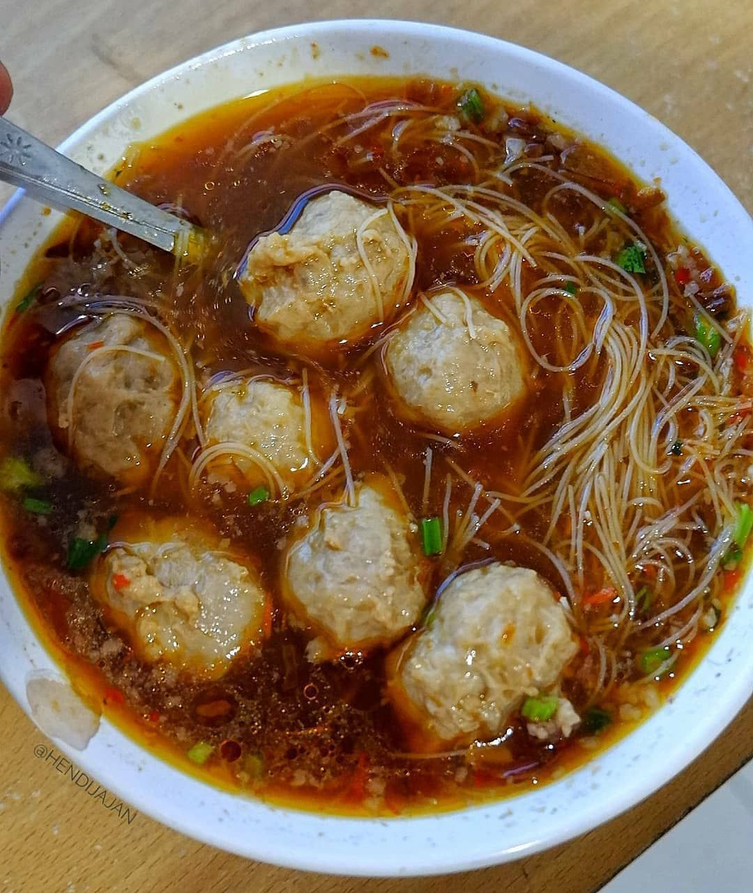
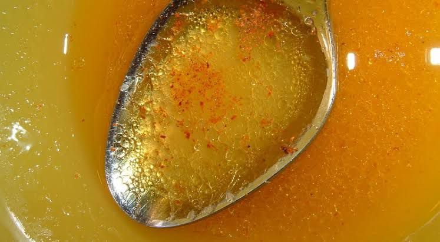

# Kebiasaan Orang Indonesia yang perlu dihentikan

Indonesia merupakan negara yang kaya akan keberagaman suku, budaya, agama, adat istiadat, kesenian hingga kuliner. Salah satu kuliner atau makanan khas Indonesia yang cukup terkenal adalah Bakso.

Bagi orang Indonesia, bakso merupakan makanan sejuta umat. Makanan yang satu ini sangat begitu populer dan mudah sekali untuk ditemukan di seluruh wilayah Indonesia. Kita dapat menemukan penjual di banyak tempat mulai dari pedagang kaki lima sampai restoran besar.

Namun, kerap ditemukan kebiasaan yang dilakukan oleh hampir sebagian besar masyarakat saat menyantap makanan yang satu ini dan seringkali masih dianggap sebagai suatu hal yang sepele. Seolah perbuatan yang mereka lakukan tidak memberikan dampak yang berarti bagi lingkungan sekitar. Padahal berawal dari hal kecil lama-kelamaan akan menjadi kebiasaan.

Kebiasaan yang menurut saya harus dan perlu untuk dihentikan tersebut adalah

**MAKAN BAKSO NAMUN TIDAK SEKALIAN MENGHABISKAN KUAHNYA.**

Setiap kali kita pergi ke warung bakso, kita pasti sering melihat mangkok-mangkok di atas meja makan warung yang masih penuh dengan kuah namun isi baksonya sudah tidak ada. Mengapa kuahnya tidak sekalian dihabiskan??

Saya pernah bertanya begitu kepada beberapa teman saya, ada yang mengatakan bahwa dia sudah sangat kenyang. Okelah, hal tersebut dapat diterima karena dia memang terlihat sudah sangat kenyang dan tidak mampu lagi untuk menghabiskan kuah baksonya itu. Ada juga teman saya yang bilang kalau dia gengsi dan takut dibilang rakus. LoL :D

Padahal kuah bakso adalah sebuah hal paling esensial dalam sajian semangkok bakso. Setengah dari nikmat bakso adalah kuahnya, yang dimasak dalam waktu lama menggunakan racikan resep rahasia si abang bakso yang diturunkan oleh nenek moyangnya. Di situlah semua sari-sari kaldu daging berkumpul, menciptakan sebuah kenikmatan luar biasa jika diseruput pelan-pelan sambil dirasakan semua paduan rasa gurih, pedas, dan asam.

Kehangatan dari kuah bakso akan menjalar ke seluruh tubuh kita. Membuat tubuh menjadi lebih bersemangat terutama saat cuaca dingin seperti sekarang ini.

Sangat disayangkan kalau kita membuang kuah bakso yang sarat akan kenikmatan tersebut.

Bayangkan jika banyak orang tidak menghabiskan kuah dari bakso yang ia makan dengan alasan sudah kenyang.

 Seharusnya jika memang ia sudah tahu tidak bisa menghabiskan kuah bakso yang ia pesan, ia bisa bilang sebelumnya kepada penjual bakso untuk menyajikan bakso dengan kuah sedikit saja. Sehingga bakso yang ia pesan habis sekaligus dengan kuahnya, dan tidak meninggalkan sisa kecuali mangkuk dan sendoknya.

Selain mubazir, kuah-kuah sisa yang sudah bercampur dengan kecap, saus sambal, dan cuka ini kemungkinan besar akan dibuang ke sungai atau setidaknya selokan yang mengalir ke sungai. Padahal bagi sebagian besar masyarakat Indonesia, sungai merupakan bagian yang penting dari hidupnya. Bagi petani, sungai merupakan sumber utama untuk pengairan sawahnya, begitu pula bagi peternak ikan air tawar dan orang yang hobi memancing di sungai.

Sehingga jika hal itu terjadi, maka dapat menimbulkan pencemaran air yang parah. Ikan-ikan akan keracunan, ekosistem di sungai akan rusak, dan air menjadi tidak layak dikonsumsi, hingga pencemaran udara akibat sungai yang berbau busuk.

Kuah-kuah sisa ini biasanya mengandung minyak atau lemak, sehingga bakso yang kita makan menjadi gurih dan enak. Minyak itu sendiri adalah senyawa lipid, senyawa yang tidak larut dalam air dan keduanya tidak bisa menyatu. Minyak akan mengambang diatas air karena massa jenisnya lebih kecil dari air.

Minyak dan air dapat membentuk suatu emulsi yang dapat menghalangi cahaya matahari untuk masuk kedalam air. Limbah emulsi air dan minyak ini disebut dengan _Oil in Water Emulsion Wastewater_. Limbah ini dihasilkan oleh industri dan rumah tangga. Akibatnya, kadar _Dissolved Oxygen_ (DO) atau kandungan oksigen di dalam air menjadi berkurang, sehingga dapat menyebabkan keracunan pada ikan.

Kuah-kuah sisa ini juga mengandung garam, kecap, sambal & kaldu ayam yang otomatis akan menaikkan kadar _Chemical Oxygen Demand_ (COD) dan _Biochemical Oxigen Demand_ (BOD), sehingga menyebabkan got atau selokan semakin menghitam dan berbau yang akan memperparah pencemaran air. Hewan-hewan yang hidup di sungai air tawar akan mati karena keracunan akibat meningkatnya kadar garam dalam sungai, apalagi mereka tidak suka dengan kecap dan sambal seperti manusia.

Selain itu, garam dan mineral rebusan tulang, dapat menaikkan parameter zat padat terlarut/_Total Dissolved Solid_ (TDS), yang membuat airnya menjadi air sadah.

Potongan daun bawang, potongan daging mikro, dan potongan-potongan lain yang tentunya menaikkan kadar _Total Suspended Solid_ (TSS), kalau membusuk akan membuat air menghitam juga. Belum lagi dapat menyebabkan selokan tersumbat jika sudah kompak bercampur dengan minyak dan buangan sisa cucian. Jadi kayak Monster Limbah alias _Fatberg_.

Kalo hanya semangkok memang dampaknya tidak berasa, tapi kalau se kelurahan ya jadinya selokan hitam dan bau juga bro.

Kalau semua orang di dunia selalu menghabiskan kuah baksonya ataupun makanan-makanan lain yang dapat mencemari lingkungan, serta para pengusaha bakso selalu mengolah kuah sisa sebelum dibuang, maka itu sebanding dengan kita mencegah pencemaran lingkungan dari 100 kebocoran minyak di tengah laut.

Saya sendiri kalau makan bakso atau makanan berkuah lainnya sebisa mungkin menghabiskan kuahnya sampai tetes terakhir, karena dari kecil saya diajarkan untuk menghabiskan makanan yang saya ambil. Karena dengan menghabiskan makanan yang kita ambil, berarti kita sudah menghargai orang yang membuatkan makanan tersebut. Dan bicara soal selera, saya lebih suka mie ayam dari pada Bakso untuk sekedar info yang mau traktir saya :)

Dimulai dari hal kecil seperti ini, secara tidak langsung kita turut berpartisipasi dalam menjaga lingkungan sekitar dari pencemaran.

Jangan biarkan Bumi kita rusak hanya karena sesuatu yang sepele.

Jadi, Selamatkan lah Bumi dengan menghabiskan Kuah Baksomu Kawan!!

---

**_Referensi:_**

[Fatberg](https://en.m.wikipedia.org/wiki/Fatberg)

[Oily Wastewater](https://www.dober.com/oily-wastewater#overview)

[Oil and Grase in Wastewater](http://www.saka.co.id/news-detail/metode-praktis-untuk-pengecekkan-minyak-dan-lemak-dalam-air-limbah--oil-and-grease-in-wastewater-)

[Wastewater Analytics Acronyms ](https://extension.uga.edu/publications/detail.html?number=C992&title=Understanding%20Laboratory%20Wastewater%20Tests:%20I.%20ORGANICS%20(BOD,%20COD,%20TOC,%20O&G))

