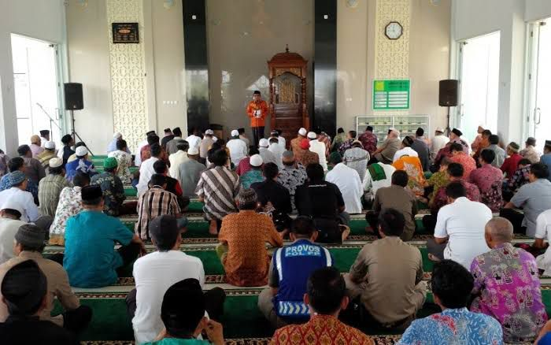

# Materi Khutbah Jumat Yang Kurang Sependapat

Belum lama ini saya menunaikan ibadah Shalat Jum'at disalah satu Masjid yang terletak tidak jauh dari rumah. Salah satu materi ceramah dari Khatib pada saat itu membahas tentang pakaian/busana laki-laki dalam shalat berjamaah.

Saya cukup sering mendengar ceramah disertai sindirian, bahkan kadang olok-olok, terhadap jamaah yang hadir di masjid mengenakan celana jeans dan kaos oblong.

_“Orang mau bertemu (menghadap) pejabat setingkat walikota saja mengenakan pakaian bagus, bahkan yang terbaik. Lah, ini mau menghadap Tuhan kok memakai pakaian celana jeans, kaos oblong, pake tulisan bahasa Inggris pula”_ demikian sindiran sang ustadz/khatib.

Berikutnya, sang khatib tak lupa mengutip Q.S. Al-A’raf ayat 31 sebagai dalilnya :

_“Hai anak Adam, pakailah pakaianmu yang indah di setiap (memasuki) mesjid, makan dan minumlah, dan janganlah berlebih-lebihan. Sesungguhnya Allah tidak menyukai orang-orang yang berlebih-lebihan”._

Bayangkan, apa yang dirasakan oleh jamaah yang jadi target sindiran tersebut. Duduknya jadi gelisah, mukanya memerah, dan hanya bisa tertunduk malu.

Dalam hati saya merasa keberatan dan tidak sependapat dengan apa yang disampaikannya.

Yang pertama, saya keberatan karena ‘dalil’ yang digunakan itu dimaknai secara naif dan konyol.

Apa yang dimaksud pakaian indah di mata Tuhan? Samakah ukurannya dengan ukuran keindahan menurut manusia? Kalau sama, maka celana jeans dan kaos oblong itu juga indah, karena indah maka dipakai oleh banyak orang (lintas etnis dan bangsa) dalam pergaulan.

Apa iya Tuhan juga membenci model pakaian dan jenis bahan pakaian tertentu? Apa cuma gamis, jubah, baju koko, dan celana cingkrang pakaian illahi itu?

Jika begitu maunya Tuhan, lantas mengapa orang yang beribadah haji hanya mengenakan ihram, dan orang mati dikuburkan hanya dengan kain kafan?

Bukankah orang yang pergi haji kerap disebut memenuhi panggilan Tuhan dan orang mati itu pergi menghadap Tuhan?

Kalau Tuhan memang menghendaki orang yang menghadapnya harus bertampilan rapih, bagus, dan mewah, maka pergi haji mestinya harus pakai stelan jas lengkap terbuat dari bahan sutra dan/atau wool. Demikian juga orang mati, jika memang Tuhan suka pakaian rapih dan bagus mestinya tidak pantas dong jika si mayat hanya dibalut kain kafan warna putih dari bahan murahan!!

Keberatan saya yang kedua adalah orang masuk mesjid untuk shalat jumat itu tidak semuanya berangkat dari rumah, sebagian ada yang sedang berada dalam perjalanan. Sehingga si jamaah tidak sempat untuk menyiapkan perlengkapan shalat jumat berupa sarung, gamis, peci, dan sajadah. Atau boleh jadi, yang bersangkutan (si jamaah) memang tidak memiliki pakaian ‘religius’.

Keberatan selanjutnya, bahwa setiap manusia memiliki standar ekonomi masing-masing. Kalau seseorang mungkin sanggupnya beli kaos atau bahkan jangankan beli, karena sangat tidak mampunya dia dikasihnya kaos itu, terus dia sholat dengan itu. 

Saya rasa standar keindahan di mata Tuhan itu bukan dari bentuk pakaiannya (harus gamis/baju koko), tapi dari pakaian terbaik yang seseorang itu miliki, sekalipun di kaos itu yang ada tulisan bahasa Inggrisnya. Karena kalau standar indahnya adalah standar manusia, maka hanya orang kaya yang boleh masuk masjid. Fakir miskin haram masuk ke sana karena pakaiannya tidak memenuhi standar keindahan manusia.

Ustadz/khatib yang seperti itu menurut saya terlalu picik dan arogan. Hal yang tidak disadarinya adalah, sindiran dan olok-olok itu sangat kontraproduktif. Bukannya memberi penguatan positif kepada jamaah yang sudah mau hadir ke masjid, malahan bisa jadi si jamaah korban olok-olok tadi justru semakin antipati terhadap keyakinannya hanya karena interpretasi yang disampaikan pemuka agama tersebut.

---

> _"Orang sering mengira bahwa ajaran >yang didemonstrasikan atau diajarkan oleh seorang pemuka, itu adalah “AGAMA”. Faktanya, yang diajarkan pemuka agama tersebut adalah INTERPRETASINYA terhadap sebuah ajaran agama. Bisa jadi ajaran agama yang sebenarnya tidak seperti yang ditunjukkan oleh pemuka tersebut"._

---
