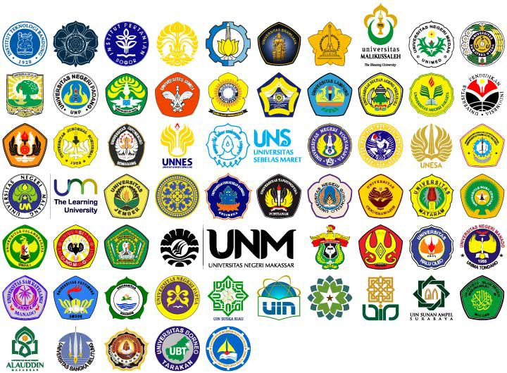

# SBMPTN

Secara umum, jalur masuk ke Perguruan Tinggi Negeri antara lain :

1. **SNMPTN** (Seleksi Nasional Masuk Perguruan Tinggi Negeri) yang pendaftarannya mulai tanggal 14 - 28 Februari dan hasilnya akan diumumkan pada tanggal 29 Maret 2022.

2. **SBMPTN** (Seleksi Bersama Masuk Perguruan Tinggi Negeri) yang pendaftarannya akan segera dibuka setelah SNMPTN pada 23 Maret - 15 April dan hasilnya akan diumumkan pada tanggal 23 Juni 2022.

3. **SMMPTN** (Seleksi Mandiri Masuk Perguruan Tinggi Negeri) yang biasanya dilaksanakan setelah tes SBMPTN. Untuk informasinya silahkan cek di website masing-masing PTN yang dituju.
Nah, disini kita hanya akan membahas tentang SBMPTN saja. Jadi, SBMPTN itu adalah jalur masuk ke Perguruan Tinggi Negeri (PTN) dengan menggunakan nilai tes UTBK kita. 

Dalam Ujian Tertulis Berbasis Komputer (UTBK) kamu akan di tes beberapa mata pelajaran yang bakal menjadi penentu kamu untuk dapat masuk atau tidaknya ke PTN yang menjadi tujuanmu. Disini juga tidak ada kaitannya dengan masalah sekolah dlsb. Sehingga hasil yang kamu dapatkan murni tanpa ada pengaruh lain.

Seperti yang kita ketauhi, bahwa di Indonesia terdapat banyak PTN yang bisa kita lihat di situs resmi Lembaga Tes Masuk Perguruan Tinggi (LTMPT).

Dari sekian banyak PTN tersebut, ada yang menjadi PTN Favorit, PTN yang sedang-sedang saja, dan juga PTN yang kurang menjadi favorit. Tidak cuman PTN nya saja, namun berlaku juga pada sebuah Program Studi / Jurusan.

Jadi, ada juga jurusan dengan peminat tinggi, sedang, hingga kurang diminati. Beberapa hal tersebut harus diketahui dengan baik sehingga kamu tidak sembarangan dalam menentukan pilihan masuk PTN.

Nah, lalu bagaimana dengan teman-teman yang nilainya bisa dibilang pas-pasan atau rendah untuk masuk melalui jalur SBMPTN?

Berikut beberapa tips yang dapat kamu terapkan dan mungkin akan sangat membantu untuk bisa memaksimalkan lolos di jalur SBMPTN.

1. **Pilih PTN sesuai dengan Kapasitas Nilai**

Saya sangat mengerti bahwa kalian ingin sekali masuk di universitas favorit yang masuk dalam kategori PTN top di Indonesia. Tapi yang jadi masalahnya tadi kan nilai, sehingga kamu harus menurunkan sasaranmu ke PTN yang bisa dikatakan populer ke PTN yang sedang-sedang saja. Karena, PTN ini berpegaruh besar terhadap kelulusanmu. 

Jadi, semakin tinggi rank dari universitas yang kamu tuju maka semakin tinggi pula tingkat persaingan untuk masuk kesana.

2. **Pilih Jurusan Yang Diminati dan Lihat Daya Tampungnya**

GAMBAR
Bingung pilih jurusan 

Jangan berpikir karena nilaimu rendah maka kamu ingin memilih jurusan yang biasa-biasa saja yang penting lolos. Pemikiran seperti ini menurut saya adalah pemikiran yang salah, karena kuliah itu tidak sebentar, dan kamu akan mendalami jurusan yang kamu pilih.

Saat kamu pilih jurusan yang kamu sendiri tidak memiliki passion nya disana, ini bisa menghambat perkembangan akademikmu nantinya. Artinya, kamu perlu untuk memperhatikan jurusan yang akan kamu pilih, dan memang kamu paham soal jurusan yang menjadi pilihanmu itu.

Berbicara tentang jurusan, yang tidak kalah penting yang harus kamu perhatikan dengan baik adalah:

- Ada Jurusan yang memiliki daya tampung banyak, dengan peminat tinggi.

- Ada Jurusan yang memiliki daya tampung banyak, dengan peminat rendah.

- Ada Jurusan yang memiliki daya tampung sedikit, dengan peminat tinggi.

- Ada Jurusan yang memiliki daya tampung sedikit, dengan peminat rendah.

Jadi, bagaimana cara memperhitungkan soal daya tampung ini terhadap nilai UTBK yang kita dapatkan??

Berikut ini sebagai contoh:

**Contoh Jurusan 1 :**

Misalkan, kamu ingin mengambil Jurusan Ilmu Politik di Universitas Haluoleo. Yang pada tahun 2021 kemarin memiliki daya tampung (kursi) sebanyak 64. Sedangkan peminatnya pada tahun 2020 sebesar 74. Maka perhitungannya 74 - 64 = 10.

Artinya, kamu harus mendapatkan nilai UTBK diatas 10 Peserta yang meminati jurusan tersebut.

**Contoh Jurusan 2 :**

Misalkan, pada jurusan yang kedua ini adalah jurusan Ilmu Hukum di Universitas Haluoleo. Tahun 2021 lalu Memiliki Daya tampung (kursi) sebanyak 160. Sedangkan peminat pada jurusan ini tahun 2020 sebesar 752. Maka perhitungan nilai UTBK kamu adalah 752 – 160 = 592. 

Artinya, kamu harus mendapatkan nilai UTBK diatas 592 Peserta yang meminati jurusan tersebut.

Jadi, berdasarkan contoh diatas, kamu memiliki peluang lebih besar di jurusan Ilmu Politik dibandingkan jurusan Ilmu Hukum.

3. **Analisis Lagi Jurusan Paling Berpeluang**

Buatlah daftar list beberapa jurusan yang kamu minati, tentukan mana paling tinggi persaingannya, yang sedang, dan yang paling rendah. Karena, hasil nilai UTBK yang kamu dapatkan akan menentukan peluang kelulusanmu di jurusan yang menjadi pilihanmu. Semakin rendah persaingan dalam jurusan pilihanmu, maka peluang kelulusanmu akan semakin besar, dan sebaliknya.

Jadi, pilihan kalian tidak sekadar ikut saran teman, mengikuti keinginan orang tua atau alasan lainnya. Tetapi pilihan itu ditentukan oleh kalian sendiri yang tentunya sudah kalian pikirkan dengan matang.

4. **Mulailah mengetahui materi-materi apa yang sering keluar di UTBK**

Sebelum berperang, pastinya kamu harus tau dulu tentang musuh, wilayah, dan keunggulan, serta kekuranganmu kan??

Nah sama juga di UBTK, kamu harus tau medan perangnya seperti apa, supaya kamu bisa lebih mudah dalam mengalahkan musuh-musuhmu. Jika memang kamu tidak sanggup untuk mempelajari seluruh materi yang akan keluar di UBTK, maka pelajarilah materi-materi yang dianggap sering keluar dalam UBTK. Apalagi zaman sekarang teknologi serba canggih, kamu bisa akses materi pembelajaran dari mana saja kan?

5. **Jangan Lupa Berdoa**

Tugas kamu adalah belajar, dan berusaha semaksimal yang kamu bisa. Namun jangan lupa untuk berdoa. Apapun hasil yang kamu peroleh nantinya, tetap positif thinking. Karena semua ada hikmahnya.

Lalu dengan polosnya seorang siswa bertanya :

Tapi Kak, apa yang sebaiknya saya lakukan di H-30 UTBK dan saya belum belajar sama sekali?

Hal yang sebaiknya kamu lakukan adalah berhenti bertanya dan mulailah belajar! Apa pun hasilnya nanti, setidaknya kamu sudah berjuang untuk UTBK!

---

_Kesuksesan adalah dampak, bukan tujuan. Karena hidupmu dimasa depan ditentukan dari langkah kakimu hari ini_

_~Andika Pramudya~_

---

_**Referensi:**_

[Jadwal Kegiatan SNMPTN 2022](https://ltmpt.ac.id/?mid=33#a1)

[Jadwal Kegiatan UTBK-SBMPTN 2022](https://ltmpt.ac.id/?mid=33#a2)

[Daftar PTN & Politeknik Negeri](https://ltmpt.ac.id/?mid=22#a1)

[Daya Tampung & Peminat SBMPTN UHO 2021](https://kampusimpian.com/daya-tampung-peminat-sbmptn-uho-universitas-haluoleo/)