# Toleransi

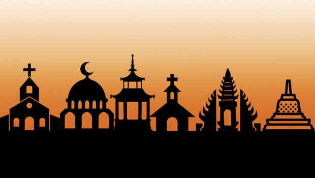

Indonesia merupakan salah satu bangsa yang memiliki cukup banyak keragaman, salah satunya adalah keragaman agama. Setidaknya terdapat enam agama yang diakui di Indonesia, yakni Islam, Kristen Protestan, Katolik, Hindu, Buddha, dan Kong Hu Cu. Dan Islam adalah kelompok agama mayoritas yang menempati Indonesia.

Dengan adanya berbagai keragaman agama tersebut, kerukunan antar umat beragama tentunya merupakan hal yang sangat penting untuk mencapai kesejahteraan hidup di negeri ini. 

Namun, di setiap penghujung tahun selalu saja diwarnai dengan perdebatan perdebatan terkait pengharaman mengucapkan selamat hari raya suatu kaum dengan anggapan bahwa tindakan itu bisa dikategorikan menyerupai, bahkan disamakan dengan kaum tersebut.

Belum lagi ditambah dengan munculannya ustad-ustad beraliran ortodoks, yang sedikit-sedikit bilang kafir, sedikit-sedikit sesat, sedikit-sedikit bid'ah. Sesuatu yang disampaikan juga cenderung mem-brainwash pengikutnya untuk menyatakan bahwa aliran yang dia ajarkan adalah yang paling lurus dan paling Islami, sedangkan yang lainnya dianggap sesat.

Karena seringnya seseorang mengikuti kajian yang seperti itu, maka ketika melihat orang lain berperilaku diluar doktrin orotodoks yang orang itu terima dari kajian yang dia ikuti maka akan terlihat seolah mereka kafir, sesat dll. Maka akan muncul dibenaknya pertanyaan-pertanyaan seperti :

_"Lho? Muslim kok ikut KB?"_

_"Lho? Muslim kok kredit motor?"_

_"Lho? Muslim kok pilih Ahok?"_

_"Lho? Muslim kok gak pakai Jilbab?"_

_"Lho? Muslim kok resepsi pernikahannya tamunya campur laki-perempuan?"_

_"Lho? Muslim kok merayakan Ultah?"_

_"Lho? Muslim kok ngucapin Natal?"_

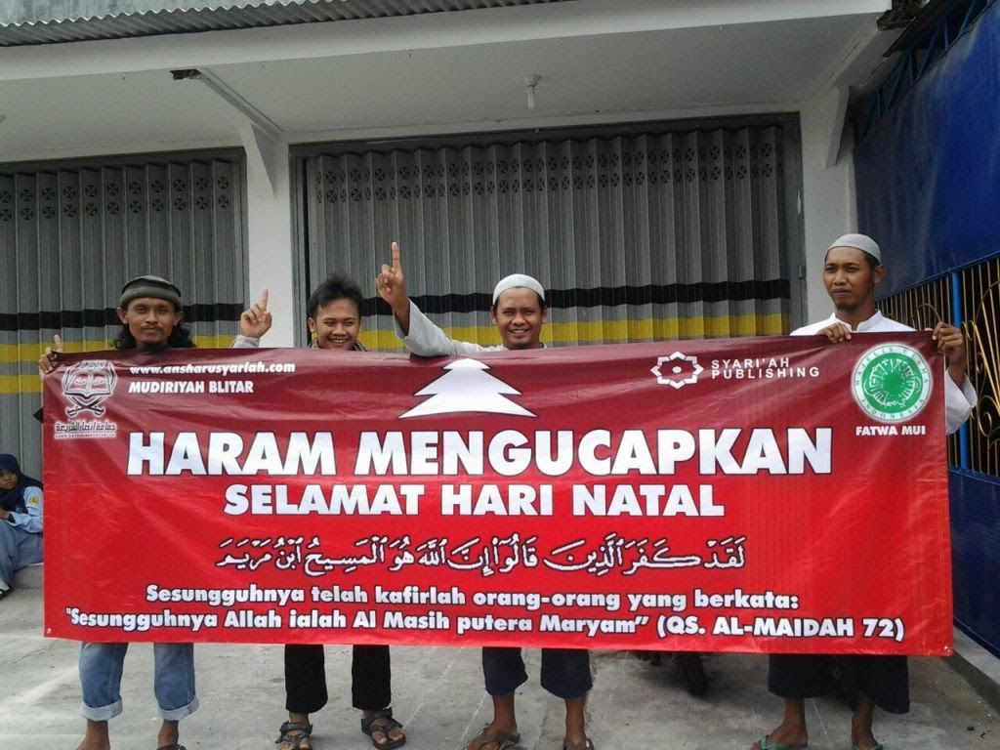

Bahkan ada yang sampai menyamakan ucapan "Selamat Hari Raya" suatu kaum dengan kalimat syahadat yang menurut saya sangatlah tidak logis.

Apakah jika seseorang mengaum (menirukan suara harimau) dia bisa disamakan dengan harimau? Atau orang yang mengembik (menirukan suara kambing) automatically menjadi kambing?

Apa iya jika seorang Kristen mengucapkan dua kalimat syahadat otomatis dia menjadi muslim? Sebaliknya, jika seorang Muslim beberapa kali memasuki bangunan gereja dia bisa dianggap telah menyerupai dan menjadi bagian dari Kristen?

Apa iya jika seorang Hindu menonton ceramah ustad di TV dapat langsung dikategorikan menjadi bagian dari muslim? Sebaliknya, apa iya orang Islam yang membaca buku Bhagavadgita, baca epos Ramayana, atau membaca Kitab Injil bisa dianggap telah menjadi Hindu atau Kristen?

Apa iya jika seorang muslim mengenakan jas dan dasi (meniru orang Barat) berarti dia sudah menjadi orang Barat?

Tentu saja tidak.

Tapi, bagi anda yang anti mengucapkan selamat hari raya kepada umat agama lain, karena takut terjebak dalam peniruan atau penyerupaan dengan suatu kaum, silakan konsisten saja. 

Kalau perlu jangan lagi mengenakan kemeja, jas, dasi, jean, T-Shirt, atau batik. Jangan lagi menonton TV, menggunakan HP dan internet. Sebab, mayoritas dari benda/barang-barang tadi menggunakan bahan dan teknologi dari negeri-negeri non-muslim.

Jika ingin lebih ekstrem lagi, seorang muslim itu jangan lagi menggunakan bahasa selain bahasa Arab. Sebab, bahasa Melayu, Jawa, Sunda, Batak, apalagi Inggris dan Mandarin itu semua budaya (bahasa) kaum non-muslim. Supaya kita terbebas dari perangkap keserupaan dengan kaum lain, maka gunakan saja bahasa asli dimana Islam dilahirkan.

Bukan hanya itu, terkadang saya merasa malu karena tak jarang menemukan kasus krisis toleransi/minim toleransi ditengah masyarakat yang pelakunya rata-rata adalah seagama dengan saya.

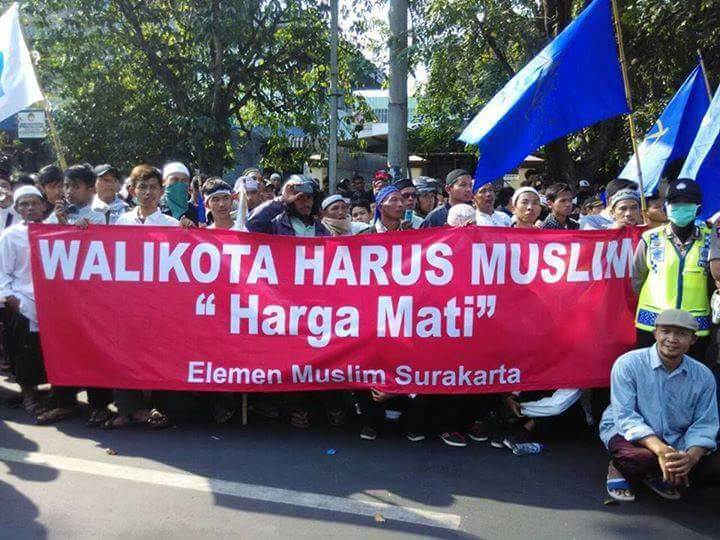

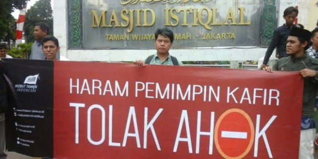

Bahkan beberapa masyarakat berpendapat pemimpin harus muslim. 

Saya heran, apakah pemimpin muslim sudah pasti berlaku adil dan baik? Sebaliknya, apakah pemimpin Kafir pasti zalim atau kejam? 

Bukankah pemimpin itu harusnya dilihat dari kualitasnya dan rekam jejaknya bukan agamanya? Percuma saja kalau pemimpin muslim tapi korupsi.

Lantas, Ahok manakah yang mereka maksud? Apakah :

Ahok yang pernah menyelamatkan 12,1 Triliun uang negara dari anggota-anggota DPR?[¹](https://news.detik.com/berita/d-2864461/dana-siluman-rp-121-triliun-akhirnya-dicoret-dari-rapbd-dki)

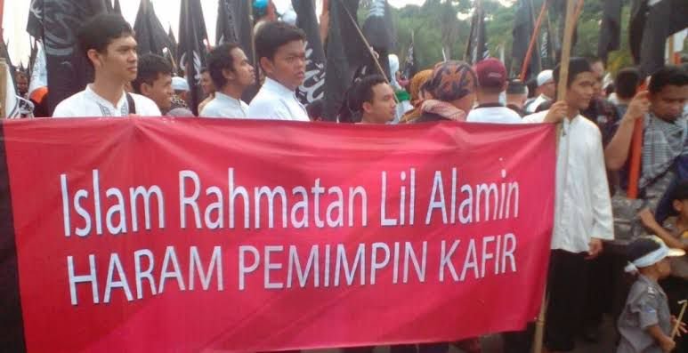

Atau mungkin maksud mereka Ahok yang mengubah tempat prostitusi menjadi taman bermain Skateboard?[²](https://palembang.tribunnews.com/2018/03/10/menengok-kembali-kawasan-kalijodo-yang-dulu-kelam-kini-penuh-warna-dan-tawa?page=all)

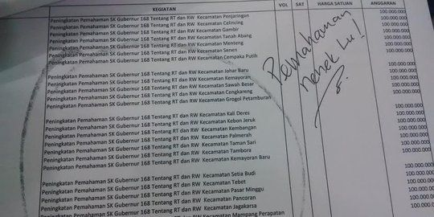

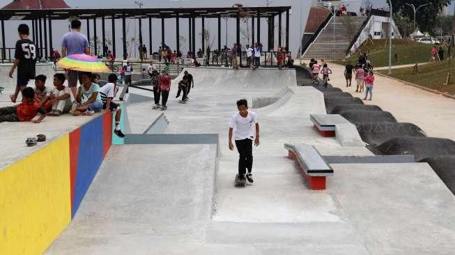

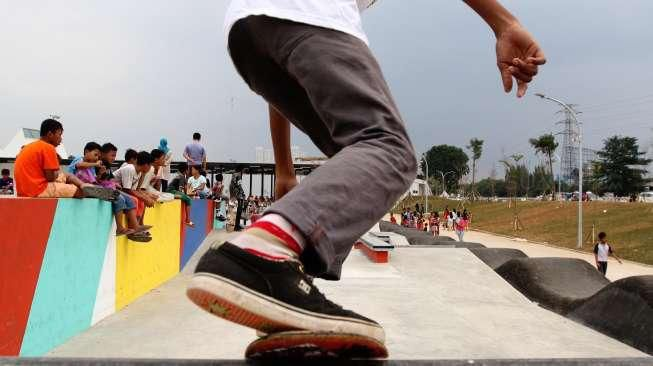

Atau Ahok yang membangun 186 RPTRA (Ruang Terpadu Ramah Anak)?[³](https://megapolitan.kompas.com/read/2017/01/16/14205991/data.pemprov.dki.rptra.yang.sudah.dibangun.berjumlah.186)

Atau Ahok yang menurunkan 2.200 titik banjir menjadi 80?[⁴](https://m.liputan6.com/news/read/2882675/ahok-kawasan-banjir-tinggal-80-titik-dari-2200-titik?utm_expid=.9Z4i5ypGQeGiS7w9arwTvQ.0&utm_referrer=https%3A%2F%2Fid.quora.com%2FApakah-menurut-Anda-secara-profesionalisme-tanpa-memandang-agama-atau-ras-Ahok-pantas-menjadi-Presiden-RI%2Fanswer%2FH-Martino-Y-S)

Atau Ahok yang membangun 50.000 rusun untuk orang miskin?[⁵](https://m.liputan6.com/news/read/2882682/bangun-50000-rusun-hingga-2017-ahok-tidak-sekedar-membual?utm_expid=.9Z4i5ypGQeGiS7w9arwTvQ.0&utm_referrer=https%3A%2F%2Fid.quora.com%2FApakah-menurut-Anda-secara-profesionalisme-tanpa-memandang-agama-atau-ras-Ahok-pantas-menjadi-Presiden-RI%2Fanswer%2FH-Martino-Y-S)

Atau Ahok yang dapat penghargaan Bung Hatta Anti-Corruption Award?[⁶](https://www.thejakartapost.com/news/2013/10/16/ahok-gets-2013-bung-hatta-anti-corruption-award.html)

Atau Ahok yang melayani warga setiap pagi dibalai kota?[⁷](https://www.suaraislam.co/duh-sedihnya-balai-kota-kehilangan-ahok-pengaduan-menurun/)

Ahok yang mana?

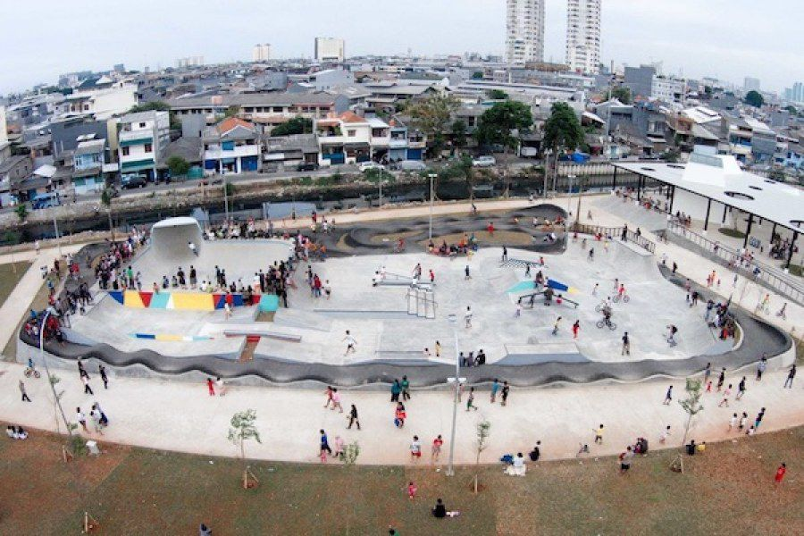 

Adalagi yang bahkan membawa - bawa jargon _"Islam Rahmatan Lil Alamin"_ tapi intolerannya bukan main. Menurut saya jargon Islam Rahmatan Lil Alamin sekarang malah berganti menjadi _"Islam Rahmatan Lil Muslimin"_.

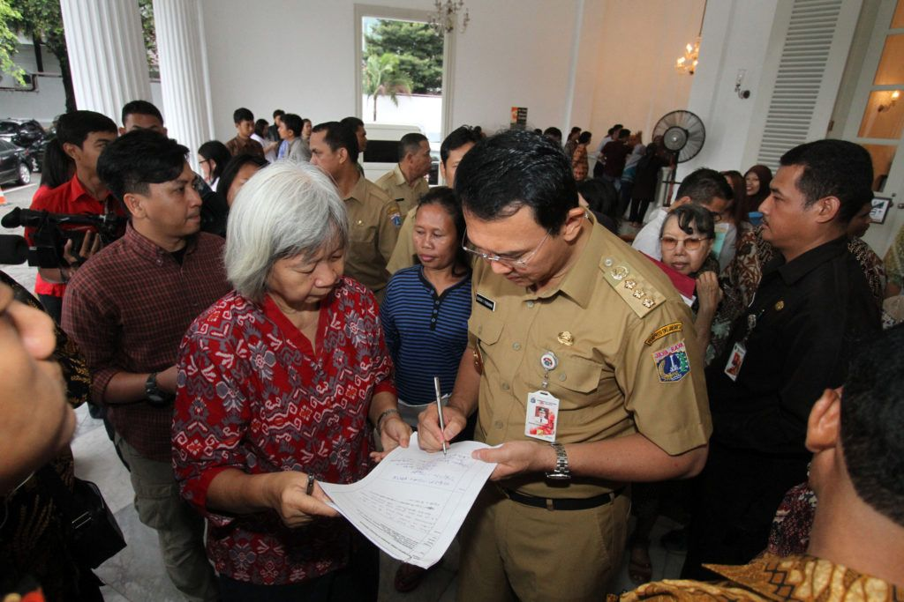

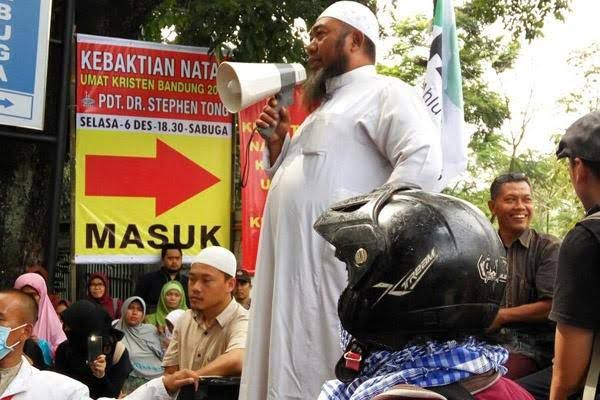 

Salahnya mereka beribadah apa? Apakah ibadah mereka membuat keributan, kerusuhan atau mereka beribadah dengan cara membunuh orang? Hal seperti ini jelas merupakan pelanggaran kebebasan beragama/berkeyakinan sebagaimana dijamin dalam Pasal 28E UUD 1945.

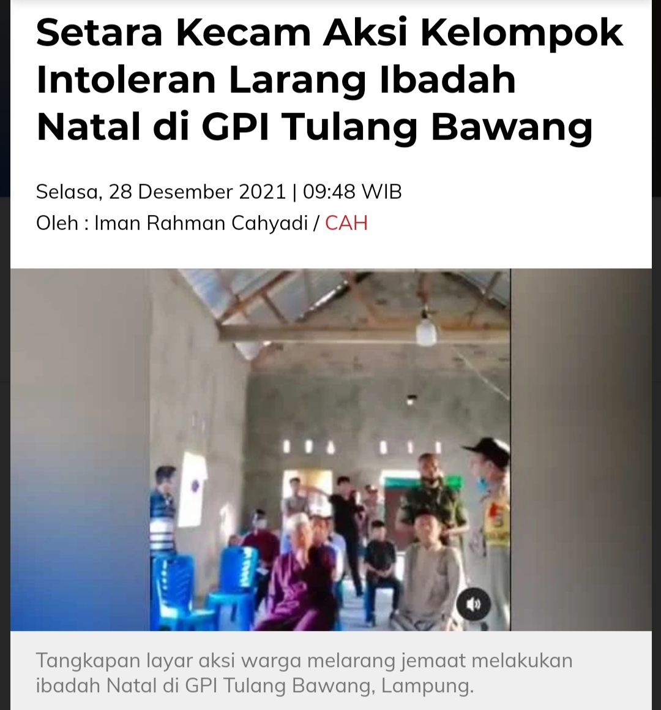 

Sangking takutnya mereka dengan kaum kafir yang akan mengusai negeri ini sampai mindset mereka selalu anti simbol-simbol yang mirip dengan agama lain.

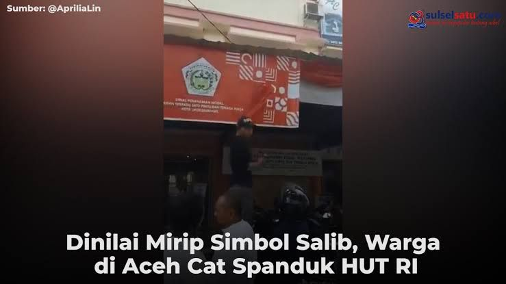

Salahnya gereja dimana sih? Apakah gereja tersebut dijadikan tempat untuk membuat kerusuhan dan kerusakan disekitar atau membunuh orang lain? Lagi pula kegiatan geraja palingan mungkin hanya tiap hari minggu sekali, sedangkan mesjid 5 kali dalam sehari ditambah lagi dengan beberapa pengajian yang menggunakan pengeras suara.

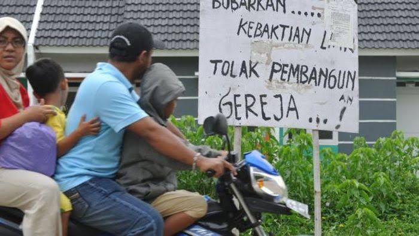

Ini juga keterlaluan. Padahal dulu walisongo menggunakan wayang kulit sebagai sarana dakwah tapi sekarang malah diharamkan. 

Apa seperti itu yang dimaksud dengan muslim sejati atau muslim kaffah? Apa itu bentuk implementasi Islam Rahmatan Lil Alamin yang benar itu? 

Justru, karena hal-hal seperti inilah umat Islam akan terus mengalami kemunduran disebabkan penganutnya memiliki pola pikir seperti itu.

Jadi, ada baiknya kita sebagai muslim lebih membuka mata, hati, dan pikiran. Hidup dengan toleransi itulah yang akan menciptakan ketenangan, kedamaian, dan kerukunan dalam masyarakat yang majemuk ini.

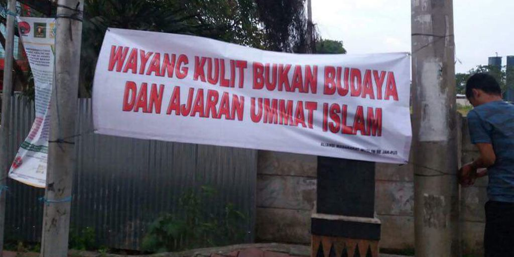

Sederhananya, toleransi itu ibarat seperti anda makan bakso, saya makan soto. 

Saya mengakui soto itu enak, anda mengakui bakso itu lezat. Saya tidak memaksa anda menikmati soto, anda tidak menjejalkan bakso ke mulut saya.

Kita makan berdampingan. Bahkan saya akan dengan senang hati mengambilkan anda kursi agar anda dapat merasakan kenyaman saat menyantap bakso. 

Saya menghormati kesukaan anda pada bakso, anda menghargai hobi saya pada soto.

Mungkin akan ada masanya anda akan menggunakan bumbu rahasia soto agar bakso anda makin mantap, atau saya berkreasi menggunakan campuran gajih/lemak dari kuah bakso agar sotonya makin _"numbero uno"_.

Atau membiarkan soto tetap soto dan bakso tetap bakso.

Belum tentu saya mengakui bakso itu benar meskipun dalam hati saya mengakui soto itu yang terbaik. Tapi, **saya tak akan sekalipun mengatakan didepan wajah anda** bahwa bakso itu sampah, memukuli anda yang sedang makan bakso, apalagi sampai saya menghancurkan warung bakso agar tidak mengancam eksistensi soto.

Tapi sayangnya hari ini, penggemar soto yang merupakan mayoritas bukan saja benci kepada penggemar bakso, tetapi mereka juga memprotes supaya rumah makan bakso yang hanya didatangi oleh penggemar bakso itu dirobohkan.

---

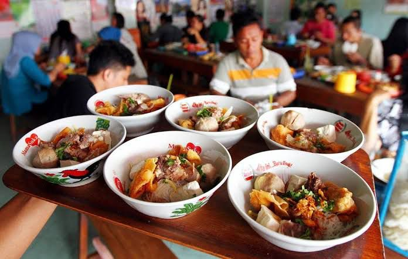 

> Agama seharusnya digunakan untuk merendahkan hati, bukan malah merendahkan orang lain.

> ~Andika Pramudya~

---

_**Catatan kaki:**_

[[1] Dana Siluman Rp 12,1 Triliun Akhirnya Dicoret dari RAPBD DKI](https://news.detik.com/berita/d-2864461/dana-siluman-rp-121-triliun-akhirnya-dicoret-dari-rapbd-dki)

[[2] Tempat Prostitusi Kalijodo Jakarta Disulap Menjadi Skate Park](https://palembang.tribunnews.com/2018/03/10/menengok-kembali-kawasan-kalijodo-yang-dulu-kelam-kini-penuh-warna-dan-tawa?page=all)

[[3] Data Pemprov DKI, RPTRA yang Sudah Dibangun Berjumlah 186](https://megapolitan.kompas.com/read/2017/01/16/14205991/data.pemprov.dki.rptra.yang.sudah.dibangun.berjumlah.186)

[[4] Ahok: Kawasan Banjir Tinggal 80 Titik dari 2.200 Titik](https://m.liputan6.com/news/read/2882675/ahok-kawasan-banjir-tinggal-80-titik-dari-2200-titik?utm_expid=.9Z4i5ypGQeGiS7w9arwTvQ.0&utm_referrer=https://id.quora.com/Apakah-menurut-Anda-secara-profesionalisme-tanpa-memandang-agama-atau-ras-Ahok-pantas-menjadi-Presiden-RI/answer/H-Martino-Y-S)

[[5] Bangun 50.000 Rusun hingga 2017, Ahok Tidak Sekedar Membual](https://m.liputan6.com/news/read/2882682/bangun-50000-rusun-hingga-2017-ahok-tidak-sekedar-membual?utm_expid=.9Z4i5ypGQeGiS7w9arwTvQ.0&utm_referrer=https://id.quora.com/Apakah-menurut-Anda-secara-profesionalisme-tanpa-memandang-agama-atau-ras-Ahok-pantas-menjadi-Presiden-RI/answer/H-Martino-Y-S)

[[6] Ahok gets 2013 Bung Hatta Anti-Corruption Award](https://www.thejakartapost.com/news/2013/10/16/ahok-gets-2013-bung-hatta-anti-corruption-award.html)

[[7] Balai Kota Kehilangan Ahok, Pengaduan Menurun](https://www.suaraislam.co/duh-sedihnya-balai-kota-kehilangan-ahok-pengaduan-menurun/)

