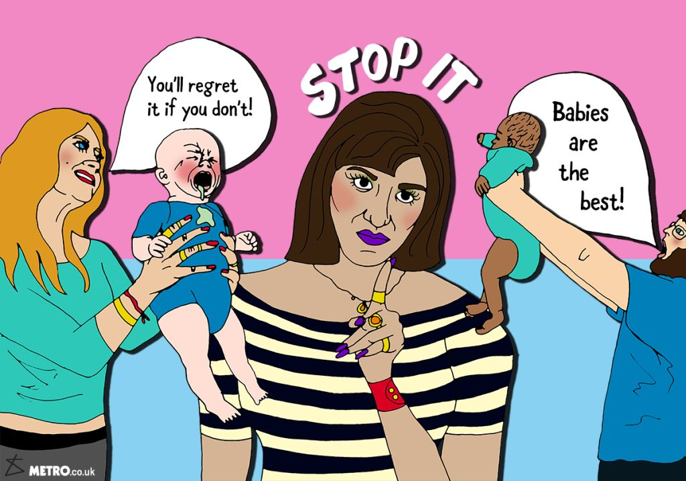
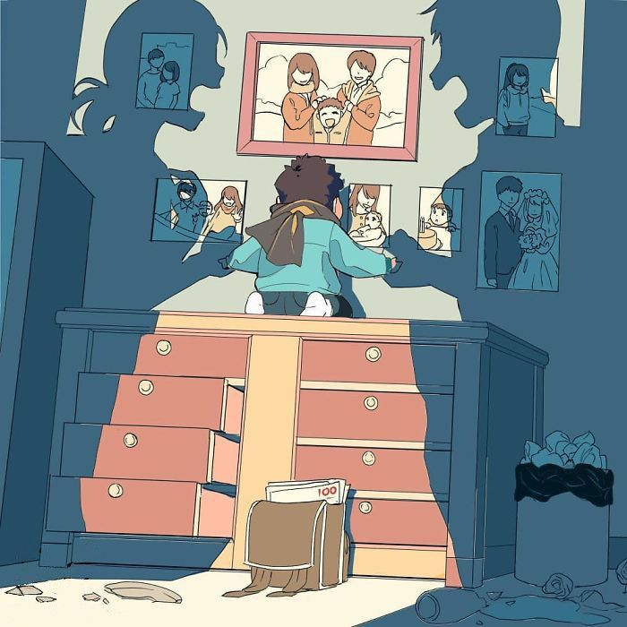
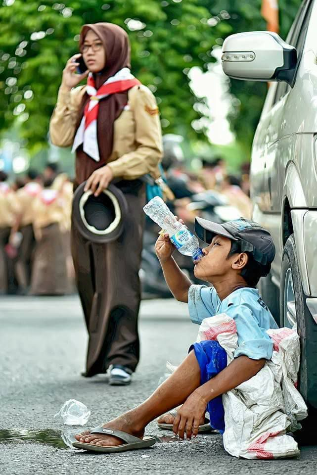
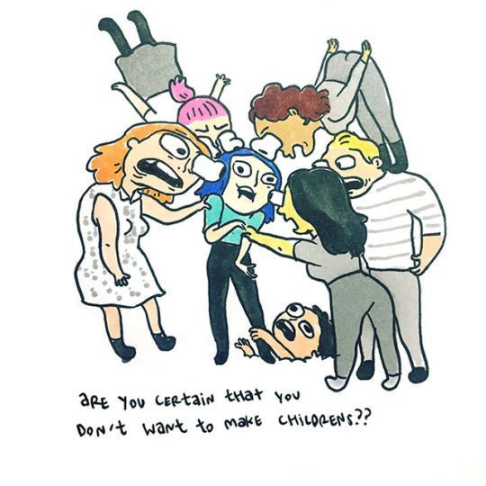
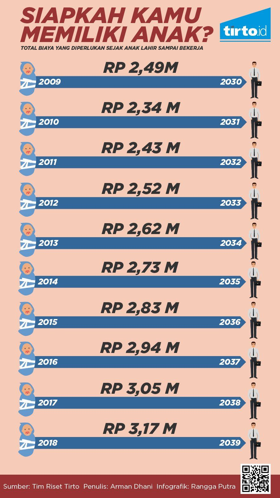
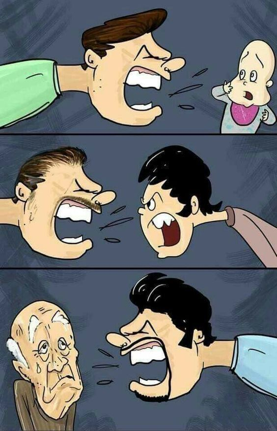
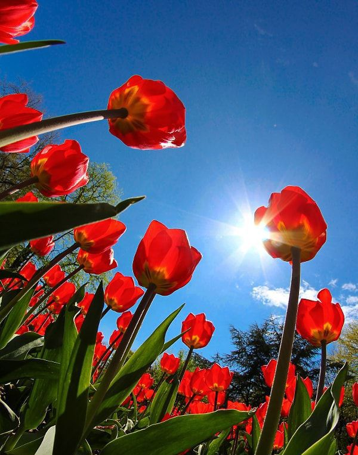

# Childfree

Dalam hidup, ada tahapan-tahapan yang apabila dijalanai maka seseorang akan dianggap memiliki hidup yang ideal. Mulai dari sekolah, kuliah, kerja terus menikah, lalu punya anak. Kalau tidak begitu ada resiko seseorang akan dianggap tidak normal, bahkan sampai dibilang menyimpang dari norma tradisi atau aturan agama. Apalagi sampai memutuskan untuk Childfree atau pilihan hidup untuk tidak memiliki anak setelah menikah.

Childfree merupakan suatu konsep yang cukup sulit bilamana diterapkan di negara kita tercinta yang masyarakatnya masih konservatif dengan budayanya yang luar biasa peduli terhadap kehidupan orang lain disekitarnya. Konsep ini juga dianggap sebagai suatu hal yang tidak biasa sehingga pasangan yang mengambil keputusan ini terkadang dianggap egois.

Hal ini tidak hanya terjadi di Indonesia, tapi hampir di semua negara berkembang. Sedangkan negara maju memiliki gerakan Childfree yang lebih kuat dan populer. Perbedaan pola pikir, budaya akan konsep berkeluarga dan hidup bermasyarakat serta tingkat level pendidikan di suatu negara menjadikan warga yang bersangkutan lebih bisa menganalisa diri sendiri apakah waktunya sudah tepat untuk memiliki anak. Bukan malah mengkhawatirkan dan memusingkan perkataan orang lain.

Semakin berpendidikan juga membuat seseorang lebih mengerti bahwa memiliki anak tidak hanya sekedar melahirkan. Tidak cukup hanya dengan dilepas ke sekolah dan dikasih makan tiap hari. Akan tetapi ada tanggung jawab besar dibelakangnya.

Memiliki anak tentunya membutuhkan kesiapan mental dan finansial yang memadai. Anda harus meluangkan waktu, merelakan privasi dan berbagai hal lain yang mungkin terjadi kedepannya untuk seorang manusia baru setidaknya sampai mereka mampu untuk mandiri. Belum lagi anak-anak tidak realistis dan ketika orang tuanya sibuk malah disalahkan, padahal untuk membesarkan anak juga pakai uang.

Karena membutuhkan persiapan yang begitu kompleks, sehingga tidak semua orang yang telah menikah siap dengan anak. Tidak semua orang juga memiliki tanggung jawab dalam membesarkan seorang anak, bahkan masih ada orang yang tidak bertanggung jawab terhadap dirinya sendiri. Baik itu ketidakmampuan secara ekonomi ataupun moral.

Ketika memaksa memiliki anak padahal tidak siap, yang jadi korban bukan cuma orang tua, tetapi juga anak yang tidak minta dilahirkan. Anak bisa menjadi tidak bahagia & terluka secara emosional dan mungkin fisik karena orang tuanya yang bobrok.

Kebanyakan masyarakat Indonesia menganggap bahwa anak adalah rezeki, amanah, investasi, ladang amal, calon penerus, buah cinta, dan lain sebagainya. Sebagian orang juga melihat anak sebagai makhluk yang lucu, pembawa kebahagiaan di keluarga, seseorang untuk dirawat dan di didik bersama-sama dengan penuh cinta hingga dewasa. Namun, bagi saya anak bagaikan tanah liat yang menunggu untuk dibentuk oleh orang tuanya.

Apa yang dilakukan orang tuanya di tahun-tahun pertama kehidupan anak mereka akan sangat menentukan masa depannya hingga hari tuanya. Dan tentu saja masih banyak orang tidak sanggup memikul tanggung jawab sebesar itu. 

Kebanyakan alasan yang sering saya dengar tatkala sepasang manusia hendak memiliki anak itu karena ingin membahagiakan orang tua. Atau hanya sekedar biar kayak potret keluarga yang ada di Instagram. Sehingga cepat memiliki anak sudah menjadi seperti life style yang cenderung justru di usia 30-an malah pisah atau terjerumus pada masalah finansial.

Saya sering melihat anak-anak yang menjadi korban perceraian atau hasil dari gagalnya orang tua dalam mendidik anak mereka. Saya terkadang kerap mendapati anak pertama yang terbebani tanggung jawab sebagai kakak dari adik-adiknya dan harus menopang hidup keluarga karena salah satu orang tua yang menjadi tulang punggung keluarga nya telah tiada.

Saya juga banyak melihat anak-anak yang tidak lagi dihidupi oleh orang tuanya, digunakan orang tuanya untuk mencari uang, bahkan orang tua yang menganggap anak adalah investasi, tabungan surga, anak sebagai pintu rezeki, atau untuk merawatnya saat tua. Jika orang tua berharap demikian kepada anaknya berarti secara tidak langsung mereka sama saja menjadikan anak sebagai budak dengan alasan **"Kalian kan sudah susah payah dilahirkan ke dunia!!"**

Lantas, apakah anak menginginkan untuk dilahirkan ke dunia ini?

Tentu tidak. Itu adalah pembenaran kedua manusia yang terlalu bernafsu saat melihat lawan jenisnya dan menghasilkan anak, seharusnya jika memang mereka belum siap dan sayang kepada anaknya tidak perlulah melahirkan anak ke dunia yang sudah penuh ini.

Sekarang lihat saja disekitar kita ada berapa banyak orang yang frustasi karena hidup? Sangat banyak. Andaikan orang tua mereka tidak arogan dan bisa menjaga alat reproduksinya tentu masalah yang mereka rasakan tidak terjadi.

Namun lain halnya di Indonesia, yang dimana memiliki anak sudah seperti kewajiban karena dorongan agama, budaya, dan masyarakat kita yang sangat mengagungkan nilai sebuah keluarga, kadang tanpa mempedulikan keadaan diri sendiri maupun lingkungan sekitar. Padahal memiliki anak sebenarnya adalah pilihan masing-masing orang yang tidak bisa dipaksakan.

Memiliki anak juga sering dianggap sebagai tuntutan hidup. Padahal, bisa jadi malah hidup sebenarnya tidak menuntut apa-apa. Sebagian orang saja yang terlalu khawatir dan memusingkan perkataan orang. Termasuk mau punya anak atau tidak.

Lagi pula, jika seseorang memiliki anak atau tidak itu bukan urusan orang lain dan juga tidak akan ada pengaruh apapun dalam kehidupan orang lain. Padahal disuruh membantu secara finansial saja orang lain tidak mau. Saya pribadi pun bingung mengapa paksaan untuk berkeluarga di negara kita tercinta terus dilakukan.

Pilihan untuk tidak mempunyai anak disini dianggap tabu, belum lagi basa-basi di negara kita setelah sekian lama tidak bertemu pasti ujung-ujungnya adalah

- _"Sendirian aja?"_

Atau

_"Kapan nikah?"_

Habis menikah makin parah apabila pasutri tidak mengumumkan bahwa mereka menjalankan konsep hidup Childfree

- _"Kapan Punya anak?"_

- _"Lama yah punya anaknya, keburu tua lho..."_

- _"Kok udah lama nikah tapi belum punya anak? Mandul yaa??"_

- _"Coba minum jamu ini, minum obat itu, berobat kesana, konsultasi kesini... biar cepat isinya!!"_

- _"Kasian cuma hidup berdua, pasti sepi rumahnya."_

- _"Dulu... mereka pernah... (menyebut aib)... makanya sekarang begini, karma susah punya anak!!"_

- _"Buktikan dong kalau kamu memang nggak mandul!!"_

Apabila pasutri mengumumkan bahwa mereka menjalankan konsep hidup Childfree

- _"Ya ampun kok bisa yah berpikiran seperti itu."_

- _"Itu si...(menyebut nama)... kok mau yah sama pasangan begitu, tidak mau punya anak. Kalau saya sih sudah pasti menolak mentah-mentah."_

- _"Mereka kok gak berfikir yah nanti tua siapa yang rawat!!"_

- _"Biarin aja gak mau punya anak, pas tua pasti repot sendiri."_

- _"Orang lain susah mau punya anak, mereka malah gak mau. Ga bersyukur!!"_

Hidup normal pun tak terhindarkan dari ocehan orang-orang yang begitu peduli dengan kehidupan orang lain

- _"Sudah hamil belum?"_

- _"Kamu nunda hamil? Kenapa? Nanti jadi susah hamil lho!!"_

- _"Kalau nggak punya anak nanti siapa yang mau nerusin usahamu?"_

- _"Buruan hamil dong, Ibu Bapak udah nggak sabar pengen gendong cucu nih."_

- _"Kamu sih suka makan sembarangan, jadinya susah hamil kan."_

- _"Sudah punya anak berapa?"_

- _"Kok anaknya masih satu?"_

- _"Kapan nambah adek?"_

- _"Belum dikasih adek? Jangan jauh-jauh lah jaraknya."_

- _"Nggak papa punya anak banyak, katanya banyak anak banyak rezeki"_

- _"Anak cuma dua?"_

- _"Kapan punya rumah sendiri?"_

Dan berbagai pertanyaan lain yang tak berujung dan tiada habisnya.

Mereka dengan mudahnya mengomentari ranah privat orang lain, padahal punya anak tidak segampang bikin anak. Setidaknya calon orang tua harus mempunyai penghasilan gabungan sekitar 15–20 jutaan perbulan untuk membesarkan anak **secara layak** di tahun 2030-an keatas, mengingat gaya hidup dan kebutuhan yang semakin berat.

Punya anak itu butuh pengorbanan besar, apalagi jaman sekarang. Persaingan hidup semakin keras. Anak manusia tidak seperti kucing yang cukup diberi makan, tempat tinggal, dan kasih sayang. Tidak begitu. Dari pengetahuan hingga akal sehat juga harus orang tua berikan sebagai dasar sebelum akhirnya mereka mampu membentuk pola pikirnya sendiri.

Masih banyak yang belum paham tentang ini dan lanjut beranak, padahal kasihan anaknya kelak tidak bisa hidup secara nyaman dan memiliki kenangan manis terhadap keluarganya dulu, akhirnya lingkaran setan kemiskinan akan terulang kembali.

Masyarakat kita juga masih banyak yang berpikir bahwa _"rezeki sudah di tangan Tuhan"_. Padahal dalam sebuah ayat yang pernah saya baca dan sering saya dengar bahwasannya Tuhan tidak akan merubah kondisi suatu kaum atau seseorang sebelum mereka merubahnya terlebih dahulu. Jadi, janganlah berharap Tuhan memberi sesuatu (rezeki) tanpa seseorang terlebih dahulu berusaha untuk mewujudkannya. Oleh karena itu, punya anak atau tidak maka rezeki tergantung dari bagaimana gigihnya usaha yang dilakukan seseorang.

Tidak sedikit juga masyarakat yang meyakini bahwa _"banyak anak, banyak rezeki"_, yang sebenarnya menurut saya hal ini hanya berlaku bagi orang tua yang tanahnya luas dan melek ilmu pertanian dan peternakan. Banyak anak banyak rezeki kalau diterapkan mentah-mentah di gemerlap metropolitan ya jadinya _**"banyak anak, banyak rezeki... (yang harus dicari)"**_. Akhirnya keteteran.

Mungkin ungkapan _"banyak anak, banyak rezeki"_ masih okelah kalau jaman dahulu ketika kebutuhan hidup tidak seribet sekarang, pernyataan seperti ini masih bisa dianut.

Bagaimana kalau jaman sekarang? Apa saja yang dibutuhkan seorang anak agar bisa bersaing? Pendidikan formal dari institusi yang kompeten, pendidikan moral dan pengasahan pola pikir agar bisa berpikir kritis di tengah terjangan informasi palsu dan pemikiran radikal, gizi yang baik dan suplemen agar tidak mudah kena penyakit yang makin aneh-aneh, management waktu karena kegiatan semakin banyak tapi waktu dalam sehari masih tetap 24 jam, gadget dan teknologi agar tidak ketinggalan kereta perubahan yang dari hari ke hari larinya semakin cepat. Dlsb.

Memiliki anak itu tanggung jawab yang besar, apalagi kalau anak sudah memasuki masa remaja dan dewasa, tanggung jawabnya akan menjadi semakin besar. Apabila orang tua gagal mendidiknya dengan baik, maka akibatnya anak bisa menjadi durhaka, atau malah menjadi pelaku utama dalam memiskinkan keluarga.

Dunia semakin sulit, persaingan semakin ketat, semuanya serba mahal. Belum lagi tingkat perceraian yang semakin tinggi. Setidaknya kedepannya Anda tidak menambah jumlah **populasi yang tidak bahagia** dengan memilih untuk Childfree atau paling tidak memilih untuk **menunda karena ketidaksiapan** akan hal itu.

Namun, berapa pun jumlah anak Anda kedepannya itu pilihan Anda. Pilihan Anda menentukan kebahagiaan Anda. Ada orang yang memperoleh kebahagiaan dengan mempunyai keluarga yang utuh dan ada juga yang memperoleh kebahagiaan dengan hidup mandiri secara individu.

Meskipun bukan penganut konsep ini, tapi bagi saya sah-sah saja apabila ada pasangan suami istri yang merasa tidak ingin memiliki anak. Apapun alasannya itu adalah hak mereka. Kita harus menghargai keputusan orang-orang dengan konsep ini, mereka berani melawan gengsi budaya, mereka tau konsekuensi, tenaga, dan biaya yang perlu dipersiapkan.

Keputusan mereka jauh lebih baik daripada orang-orang yang memaksakan diri untuk punya anak karena tuntutan sekitar, atau hanya demi memenuhi checklist hidup tanpa memikirkan kenyamanan atau kesejahteraan anak dalam kacamata finansial. Ujung-ujungnya anak ditelantarkan atau tidak mendapat hidup yg layak ataupun kasih sayang penuh. Kasihan anaknya hidup susah, hasil ego orang tuanya yang tidak berpikir kedepan. Malahan menjadikan anak sebagai sapi perah atau tabungan yang siap di petik di masa tua.

---

_"Anak bukan seperti padi yang waktu kecil ditanam, diberi pupuk, ketika sudah matang dipetik dan diambil gabahnya. Seharusnya anak itu seperti sebuah bunga yang waktu kecil ditanam, diberi pupuk yang terbaik, ketika sudah mekar dinikmati dari kejauhan._

_Membiarkannya menebarkan wangi dan keindahan di sekitarnya."_

_~Andika Pramudya~_

