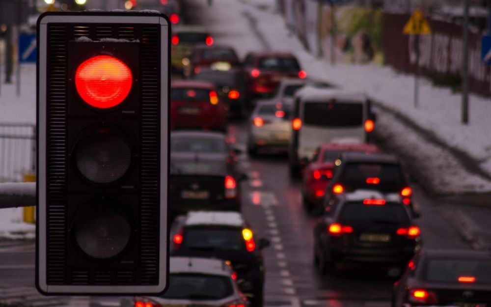
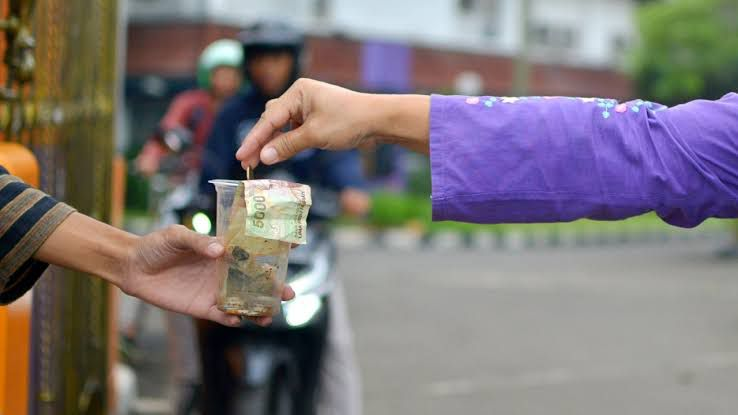
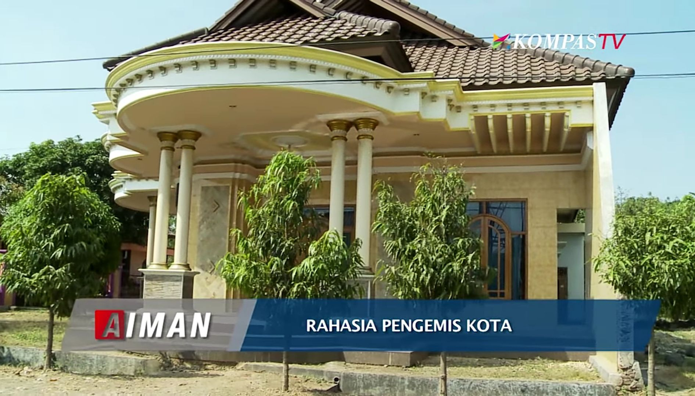
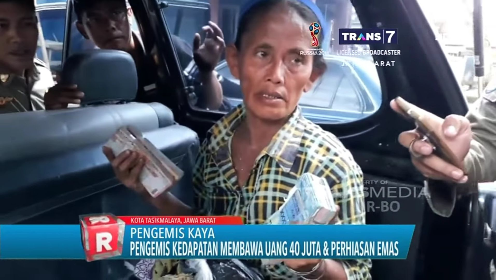
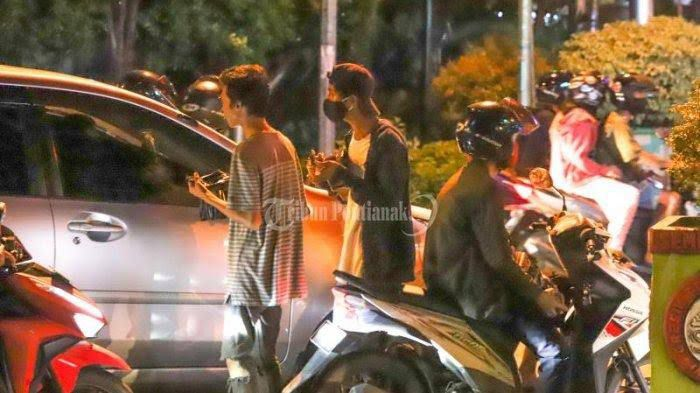
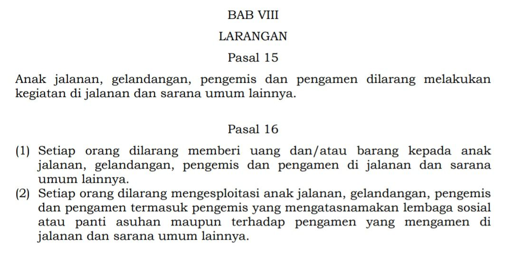
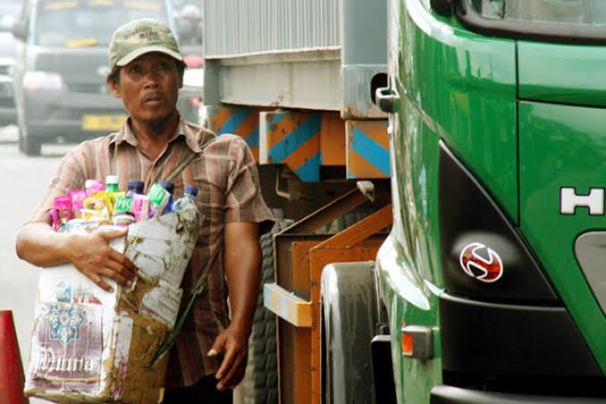

# Memberi Pada Tempatnya

Setiap kali melewati persimpangan jalan yang ramai dan padat kendaraan, biasanya terdapat traffic light / lampu lalu lintas (populer dengan sebutan lampu merah) yang berfungsi untuk menertibkan pergerakan kendaraan dari berbagai arah sehingga menjamin kelancaran arus lalu lintas serta mengurangi tingkat kecelakaan.

Lampu lalu lintas ini juga telah diatur sedemikian rupa agar lebih lama waktu berhentinya daripada waktu jalannya. Waktu yang hanya beberapa menit ini terkadang kerap dimanfaatkan oleh beberapa orang ataupun oknum dengan memasang mimik wajah kasihan serta berpakaian lusuh sambil mengulurkan tangan untuk mengharapkan belas kasih para pengguna jalan.

Terkadang beberapa orang seketika terusik sisi kemanusiaannya sehingga memberi selembaran uang ataupun receh yang kebetulan ada di kantong celana. Padahal bagi saya mereka hanyalah memberi makan ego mereka. _"Wah ternyata saya orang baik, bisa kasih uang ke pengemis"_, tanpa mau peduli kemana uang itu akan berakhir.

Memberi uang kepada para Pengemis atau Peminta-minta sudah menjadi kebiasaan buruk karena mengakibatkan tumbuh suburnya profesi semacam ini hampir di setiap persimpangan lampu merah.

Mungkin beberapa orang bakal mencela karena saya mengatakannya sebagai kebiasaan buruk. _"Kalau gak mau memberi lebih baik diam. Gak usah banyak omong sok bilang kebiasaan buruk"_.

Padahal mentalitas seperti ini yang membuat budaya mengemis jadi semakin subur. Mereka yang hanya bermodalkan wadah air minum gelasan atau kardus bekas yang digunakan untuk mengemis di lampu merah bisa mendapatkan penghasilan setara dengan gaji Manajer.

Tidak percaya? Mari kita berhitung :

Anggaplah di sebuah persimpangan, durasi lampu merahnya 90 detik, diikuti lampu hijau 30 detik, berarti satu periodenya 2 menit.

**π = {90 + 30 = 120 detik = 2 menit} |
(Satu periode lampu merah)**

Misal dalam sekali periode lampu lalu lintas (merah, kuning, hijau) tarulah si pengemis cuma mendapatkan uang sebanyak 2000 rupiah saja (kita ambil yang paling minimal), berarti dalam 1 jam dia bisa mendapatkan uang sebanyak 60.000 rupiah.

**π = {(60 / 2) x 2000 = 60.000} | 
(Penghasilan selama satu jam)**

Anggaplah si pengemis termasuk orang yang malas dan cuma mangkal selama jam-jam sibuk, yaitu jam ketika orang-orang berangkat kerja (06.00-08.00), jam makan siang (11.00-13.00), dan jam pulang kerja (16.00-18.00). Dari total 6 jam mengemis dia bisa mendapatkan uang sebanyak 360.000 rupiah.

**π = {6 x 60.000 = 360.000} | 
(Penghasilan selama sehari)**

Ok, kita ambil kemungkinan terkecil lagi, anggaplah dalam satu minggu dia cuma mengemis pada hari yang dia anggap ramai, sebut saja misalnya hari Senin, Selasa, Rabu, Kamis dan Jumat. Sedangkan hari Sabtu dan Minggu dia gunakan untuk "libur kerja". Dari total 5 hari mengemis dia bisa mendapatkan uang sebesar 1.800.000 rupiah dalam seminggu.

**π = {5 x 360.000 = 1.800.000} | 
(Penghasilan selama seminggu)**

Dalam satu bulan rata-rata ada 4,3 minggu (karena kadang kurang & kadang juga lebih, maka kita ambil saja tengah-tengahnya menjadi 4 minggu). Dari total 4 minggu (sebulan) mengemis dia bisa mendapatkan uang sebesar 7.200.000 rupiah.

**π = {4 x 1.800.000 = 7.200.000} | 
(Penghasilan selama sebulan)**

Bagaimana kalau dalam satu periode lampu merah si pengemis mendapatkan uang sebesar 3000 rupiah dan bukan 2000 seperti asumsi paling minimal di atas, berapa pendapatannya dalam sebulan?

**Rp. 10.800.000 (Sepuluh juta delapan ratus ribu rupiah).**

Bagaimana kalau dalam satu periode lampu merah si pengemis mendapatkan uang sebesar 4000, 5000 atau 10.000 ??

Seperti itu kira-kira pendapatan bersihnya selama satu bulan, si Pengemis atau Peminta-minta yang kalian bilang kasihan dan kalian anggap rendah. Nyaris 11 juta rupiah bersih tanpa dipotong pajak, cicilan, asuransi, iuran, bpjs, dlsb.

Sedangkan berapa pendapatan orang-orang kantoran yang berpenampilan rapi dan wangi. Apakah sampai sepuluh juta dalam sebulan??

Bukan karna iri dengan apa yang mereka dapatkan, tapi pada cara bagaimana mereka mendapatkan uang, yang pada akhirnya hanya akan mematikan rasa empati dan kepedulian kita pada orang berkebutuhan yang seharusnya kita bantu.

Tidak hanya Pengemis ataupun Peminta-minta. Saya juga skeptis dengan pengamen yang tidak niat dalam menjual suaranya, mereka sama saja dengan Pengemis tetapi ditambah dengan suara-suara berisik dan sesekali menggangu. Mereka sama sekali tidak niat mengamen dan hanya ingin mendapatkan uang dengan cara mudah.

Di sisi lain sebenarnya para Pengemis dan Peminta-minta juga tidak bisa sepenuhnya disalahkan, justru pola pikir kita lah yang membuat para pengemis menjadi tumbuh subur dan menjamur ke berbagai penjuru kota.

Mereka selalu saja berkeliaran di jalan dan semakin hari jumlahnya kian bertambah. Tidak lain dan tidak bukan hal ini disebabkan karena **hampir semua orang memberi mereka uang**.

Padahal dalam Peraturan Daerah sebagian besar kabupaten/kota yang ada di Indonesia, seperti halnya Perda Kota Kendari Nomor 9 Tahun 2014 yang telah mengatur mengenai larangan untuk memberi uang ataupun barang kepada anak jalanan, gelandangan, pengemis dan pengamen di jalanan dan sarana umum lainnya.

Lalu bagaimana kalau memang niat kita benar-benar ingin berbagi atau sedekah??

Banyak diluar sana lembaga zakat seperti **Dompet Dhuafa** atau **BAZNAS (Badan Amil Zakat Nasional)**. Datangi mereka dan donasikan harta kita disana. Mudah-mudahan benar disalurkan ke orang orang yang memang membutuhkan.

Atau jika Anda merasa itu merepotkan, ada cara lain yang lebih mudah. Kalau Anda melihat anak kecil atau lansia yang jualan tisu atau minuman, beli saja dari mereka daripada beli di Indomaret atau Alfamart. Selisihnya mungkin cuma 1000-2000 rupiah lebih mahal, tapi sangat berharga bagi mereka.

Atau lebih sederhana lagi kita bisa menawarkan air minum ke abang pengantar paket atau driver ojol. Kalau mampu, berikan mereka tip kepada setiap jasa yang kita pakai (kecuali jika servicenya tidak memuaskan).

Karena bagi saya sedekah itu bisa dari mana saja, tidak harus lewat Pengemis atau Peminta-minta. Yang paling gampang ya lewat kotak amal di tempat ibadah masing-masing atau berbagi kepada keluarga, tetangga atau teman kita yang terlihat membutuhkan. Bagi saya itu jauh lebih baik dan terhormat.

Namun, ironisnya yang tidak mau memberi Pengemis atau Peminta-minta akan dicap jahat dan akan terkena azab karena enggan bersedekah. Sehingga kebiasaan memberi tidak pada tempatnya menjadi sulit untuk dihilangkan.

---

> _"Orang yang paling bahagia bukanlah orang yang mendapatkan lebih, tetapi orang yang memberi lebih kepada mereka yang membutuhkan."_
> 
>_~ Andika Pramudya ~_
